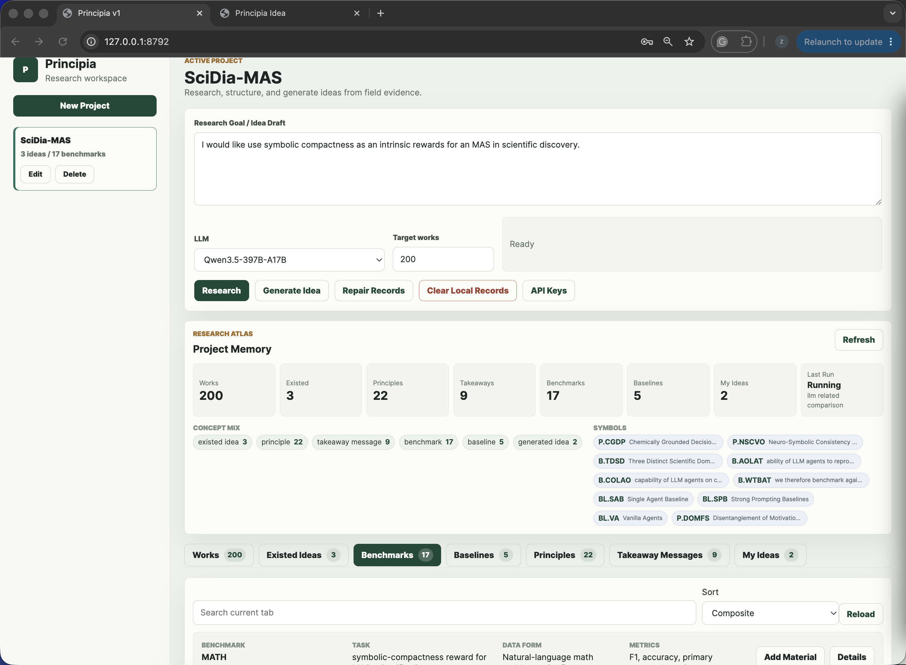
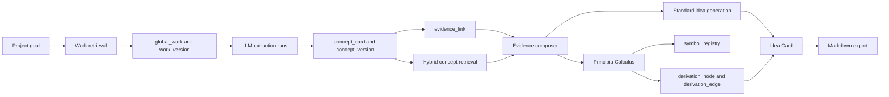

<div align="center">

# Principia v1.0

**A local-first research intelligence system for evidence-grounded idea generation.**

Principia turns papers, benchmarks, baselines, principles, and symbolic derivations into traceable research ideas that can be inspected, challenged, exported, and improved.

<p>
  
  
  
  
</p>

<p>
  <a href="#overview">Overview</a> ·
  <a href="#product-tour">Product Tour</a> ·
  <a href="#principia-calculus">Principia Calculus</a> ·
  <a href="#quick-start">Quick Start</a> ·
  <a href="#architecture">Architecture</a> ·
  <a href="#contact">Contact</a>
</p>

</div>

<p align="center">
  
</p>

## Overview

Principia v1.0 is the first product-oriented release of Principia. It upgrades the earlier 0.x demo into a structured local research system with normalized memory, source-grounded extraction, concept-level retrieval, cancellable LLM workflows, and a symbolic generation mode called **Principia Calculus**.

The core premise is simple: high-quality research ideas should not come from a single opaque prompt. They should emerge from a controlled pipeline that preserves source works, extracts reusable concepts, records evidence links, tracks versions, verifies symbolic derivations, and makes the final idea auditable.

Principia is designed for researchers who need to move from a broad goal to a concrete, testable, paper-ready idea while keeping provenance visible at every step.

## What Principia Helps You Do

| Stage | What Principia provides |
| --- | --- |
| Research | Search and ingest relevant works, preserve metadata, and run per-work extraction. |
| Extraction | Convert papers into existed ideas, principles, takeaways, benchmarks, baselines, and result facts. |
| Memory | Store concepts in a normalized local SQLite schema with evidence links, version history, FTS search, and project memberships. |
| Retrieval | Retrieve concepts independently by type instead of showing every child record from a matched paper. |
| Composition | Select research evidence into a project-scoped evidence composer. |
| Generation | Produce new Idea Cards through standard synthesis or symbolic Principia Calculus. |
| Inspection | Review lineage graphs, principle maps, source works, related idea comparisons, and generated method details. |
| Export | Export idea pages as Markdown for external agents, experiments, method writing, or paper development. |

## Product Tour

### Research workspace and source works

Principia starts from a research goal, retrieves relevant works, and keeps the project workspace local, inspectable, and interruptible.

| Research goal | Works library |
| --- | --- |
|  |  |

### Evidence composer and generated ideas

Evidence can be selected from works, principles, existed ideas, benchmarks, baselines, and takeaways before generation. Generated ideas remain tied to their selected materials.

| Compose from research evidence | Generated idea overview |
| --- | --- |
|  |  |

### Symbolic lineage and principle map

Principia Calculus makes the reasoning process visible through lineage nodes, edges, symbol references, derived concepts, and principle relationships.

| Symbolic lineage graph | Principle map |
| --- | --- |
|  |  |

### Research concepts and related comparisons

Concept records are organized by type, while generated ideas can be compared against related prior ideas for novelty and redesign.

| Principles tab | Related idea comparison |
| --- | --- |
|  |  |

## Core Capabilities

### Local-first research memory

Principia uses a local SQLite database as the default system of record. The v1 schema separates works, work versions, extraction runs, concept cards, concept versions, evidence links, symbols, derivation runs, derivation graphs, project memberships, and run events.

This allows the same paper-level extraction to be reused across projects while project-specific goals, selected evidence, generated ideas, and run states remain isolated.

### High-quality information extraction

Extraction is designed around objective, complete, source-grounded research concepts:

- **Existed ideas**: general and inspiring technical ideas with mechanism, source works, and discussion.
- **Principles**: fundamental arguments supported by evidence from source works.
- **Takeaway messages**: reusable findings with conditions, interpretation, and engineering relevance.
- **Benchmarks**: official or clearly named evaluation settings, tasks, datasets, and metrics.
- **Baselines**: methods explicitly used as comparison systems in source works, with methodology and performance when available.
- **Works**: title, abstract, authors, venue/date, links, identifiers, and extraction status.

Online LLM failures are surfaced as failures. Principia does not silently replace failed LLM output with template-like filler.

### Cancellable and partially persistent runs

LLM-heavy stages are run-level operations. A user can terminate research or generation without losing completed batches. Late responses are not saved after cancellation, and completed extraction results remain available.

### Concept-level retrieval

Principia retrieves concepts by type. It does not simply retrieve a paper and display every child item under that paper. Returned concepts include source evidence, score components, version metadata, and retrieval rationale.

### Idea pages for serious follow-up

Generated Idea Cards include mechanistic design, method variants, derived principles, validation plans, relevant baselines, source evidence, related idea comparisons, principle maps, symbolic lineage, and Markdown export.

## Principia Calculus

Principia Calculus is the symbolic generation mode in v1.0. It is built for research ideation workflows where token-efficient reasoning, provenance, and recursive improvement matter.

Instead of asking an LLM to write a final idea in one pass, Principia Calculus:

1. Builds a symbol table over selected and retrieved evidence.
2. Generates compact derivation patches.
3. Verifies references, node types, support links, and derived-from relations.
4. Stores speculative L0 nodes and higher-order derived nodes.
5. Synthesizes a final Idea Card from verified derivation structure.
6. Renders a lineage graph that can be inspected node by node.

The result is not just a generated paragraph. It is a traceable derivation object with source evidence, concept links, and a visual reasoning path.

## Architecture



## Included Release Snapshot

This repository includes the current v1.0 release database:

```text
data/principia.sqlite
```

The database preserves two projects from the release workspace:

- `SciDia-MAS`
- `LLM+logics`

The database was compacted with `VACUUM INTO` and checked with `PRAGMA integrity_check`. Runtime WAL/SHM files, logs, cached PDFs, private `.env` files, and API keys are excluded.

To start from an empty local workspace after cloning, run:

```bash
python3.12 principia.py reset --yes
```

## Repository Layout

```text
.
├── principia/                  # Principia v1 Python package
├── static/                     # Browser UI
├── tests/                      # v1 regression tests
├── data/
│   ├── principia.sqlite        # included v1.0 release database
│   └── artifacts/              # local artifact folders, gitkept empty
├── docs/screenshots/           # README screenshots
├── legacy/v0-demo-jun8-v2/     # archived Principia 0.x demo source
├── principia.py                # CLI entrypoint
├── requirements.txt
└── principia_v1_design_proposal.md
```

The `legacy/v0-demo-jun8-v2/` folder keeps the old demo source for reference. Private databases and `.env` files from the old demo are intentionally excluded.

## Quick Start

Principia v1.0 requires Python 3.9 or newer. Python 3.12 is recommended and was used for release validation.

```bash
git clone https://github.com/pzqpzq/Principia.git
cd Principia
python3.12 -m pip install -r requirements.txt
cp .env.example .env
python3.12 principia.py serve --host 127.0.0.1 --port 8792
```

Open the local app:

```text
http://127.0.0.1:8792/
```

## LLM Configuration

Principia supports SiliconFlow and OpenAI-compatible model endpoints. Put private keys only in `.env`.

```text
SILICONFLOW_API_KEY=your_siliconflow_key_here
OPENAI_API_KEY=your_openai_key_here
PRINCIPIA_LLM_BASE_URL=https://api.siliconflow.cn/v1
PRINCIPIA_OPENAI_BASE_URL=https://api.openai.com/v1
PRINCIPIA_REQUEST_TIMEOUT=180
PRINCIPIA_SLOW_REQUEST_TIMEOUT=420
PRINCIPIA_COST_LIMIT_CNY=1000
PRINCIPIA_SSL_VERIFY=1
```

Large research models can require longer request windows. If a provider times out or returns an invalid response, Principia preserves completed work and reports the failure rather than fabricating replacement content.

## CLI

```bash
python3.12 principia.py serve --host 127.0.0.1 --port 8792
python3.12 principia.py state --v1
python3.12 principia.py research "efficient LLM research agents" --target-works 100
python3.12 principia.py retrieve "adaptive compute routing" --types principle,takeaway_message
python3.12 principia.py generate "new idea for agent memory" --mode principia-calculus
python3.12 principia.py symbols --namespace default
python3.12 principia.py lineage MI-...
python3.12 principia.py export MI-...
python3.12 principia.py migrate
python3.12 principia.py reset --yes
```

Legacy-compatible commands remain available for older workflows:

```bash
python3.12 principia.py ingest "long-context reasoning efficiency"
python3.12 principia.py principles "adaptive budget allocation"
python3.12 principia.py graph --query "agent memory"
```

## API Surface

Stable v1 endpoints:

```text
POST /api/v1/research/start
GET  /api/v1/research/status
POST /api/v1/research/cancel
GET  /api/v1/projects
GET  /api/v1/project/tab
GET  /api/v1/item/detail
POST /api/v1/item/update
POST /api/v1/item/refresh/start
POST /api/v1/retrieve-concepts
POST /api/v1/ideas/standard-generate
POST /api/v1/ideas/symbolic-generate
GET  /api/v1/ideas/{idea_id}/lineage
GET  /api/v1/symbols/table
GET  /api/v1/symbols/expand
POST /api/v1/feedback/ingest
```

Temporary `/api/v2/*` aliases remain for compatibility while older UI flows are migrated.

## Data Model

Principia v1.0 uses a normalized global memory layer:

```text
global_work
work_version
extraction_run
concept_card
concept_version
evidence_link
symbol_registry
derivation_run
derivation_node
derivation_edge
project_record_membership
run_event
embedding_index
migration_status
```

SQLite FTS5 indexes support full-text search over works and concepts. The optional embedding table gives the system a future-compatible hybrid retrieval structure without making vector dependencies mandatory.

## Quality and Safety Rules

Principia v1.0 follows several strict rules:

- Failed online LLM calls must not create template-style replacement ideas.
- Offline/demo fallback content must be explicit and labeled.
- Paper full text can be used transiently for extraction, but full text is not retained locally.
- Benchmarks and baselines should be official, named, and source-grounded.
- Ideas, principles, and takeaways should be objective, complete, independent arguments.
- Project state, selected evidence, and run status should remain isolated across projects.
- Cancellation preserves completed batches and blocks late writes from cancelled runs.

These constraints are product requirements, not cosmetic preferences. They are central to making generated research content trustworthy enough for serious follow-up.

## Tests

Run the regression suite:

```bash
python3.12 -m unittest discover -s tests -v
```

Release validation:

```text
106 tests OK
```

The test suite covers schema creation, migration, work identity resolution, work versioning, extraction cache behavior, quality gates, FTS search, symbol collision handling, derivation verification, symbolic generation, cancellation, related comparisons, Markdown export, and no-template-fallback regressions.

## Development Notes

- Keep secrets in `.env`; never commit API keys.
- Do not commit WAL/SHM files, runtime logs, cached PDFs, or local temporary artifacts.
- `data/principia.sqlite` is intentionally included as the v1.0 release snapshot.
- Use `/api/v1/*` for new frontend work.
- Keep `/api/v2/*` only as temporary compatibility coverage.
- Run tests before publishing changes.

## Contact

For business collaboration, contact [peizhengqi@chipflow.net](mailto:peizhengqi@chipflow.net).

For academic collaboration, contact [peizhengqi22@mails.ucas.ac.cn](mailto:peizhengqi22@mails.ucas.ac.cn).

