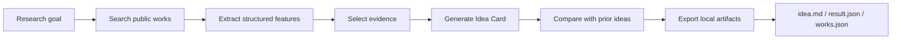

# Principia

Ideas from principles, validated by evidence.

**Principia is a local-first research system for turning literature into reusable principles, composing those principles into traceable research ideas, and helping researchers inspect why an idea may be worth testing.**

Principia now has two complementary surfaces:

| Surface | Best for | How you use it |
|---|---|---|
| **Principia V1.3 Framework** | Python notebooks, scripts, research pipelines, agent workflows, and package-level integration | `pip install principia-ai`, then `import principia as pc` |
| **Principia Visual Workbench** | Local browser-based research exploration, evidence selection, principle maps, Idea Cards, and Cloud Library workflows | Run the local app and open `http://127.0.0.1:8795/` |

V1.3 is intentionally a **pure framework release**: there is no frontend page required. The same principle-first workflow can be called directly from code, which means Principia is not only an operating interface, but also an open-source research framework that can be embedded inside notebooks, local scripts, CI jobs, and assistant pipelines.

[](https://github.com/pzqpzq/Principia)
[](https://pypi.org/project/principia-ai/)
[](#principia-v13-framework)
[](https://icml.cc/virtual/2026/poster/61557)
[](#research-integrity-and-privacy)
[](#principia-cloud-library)
[](#quick-start)

**Research Highlight** · **Why Principia** · **Principia V1.3 Framework** · **Framework Tutorial** · **Visual Workbench Tour** · **Quick Start** · **Contact**

---

## Research Highlight

Principia is connected to our ICML research on symbolic communication among LLM agents:

> **[When LLMs Develop Languages: Symbolic Communication for Efficient Multi-Agent Reasoning](https://icml.cc/virtual/2026/poster/61557)**  
> ICML 2026

The paper introduces **Communicative Language Symbolism Routing (CLSR)**, a test-time framework where multiple LLM agents autonomously invent, evolve, share, and route compact **Language Symbolism Frameworks (LSFs)** to improve the accuracy-token trade-off.

**Principia Calculus** brings this idea into research ideation: instead of asking an LLM to directly write a proposal, Principia lets the model build intermediate symbolic handles, compose them, verify derivation steps, and expose the lineage behind the final Idea Card.

---


From a rough research goal to a structured, lineage-backed idea workspace.

---

## Why Principia

Most AI brainstorming tools produce fluent text. Principia is designed for a higher standard: **a good research idea should show where it came from, what it assumes, what evidence supports it, and how it can be tested.**

Principia turns ideation into a visible and reusable workflow:

```text
research goal
  → relevant works
  → existed ideas
  → principles
  → takeaway messages
  → evidence selection
  → symbolic derivation
  → Idea Card
  → prior-idea comparison
  → validation plan and export
```

### What makes it different

| Instead of... | Principia gives you... |
|---|---|
| Black-box brainstorming | Idea Cards with source evidence, assumptions, risks, and derivation traces |
| Paper summaries only | Reusable principles, benchmarks, baselines, takeaways, result facts, and existed ideas |
| RAG over whole papers | Concept-level retrieval: select only the specific evidence that should influence generation |
| One-shot idea generation | Standard generation plus deeper **Principia Calculus** and **SciDialect-Evo** modes |
| A UI-only research tool | A local visual workbench **and** a direct Python framework API |
| Local notes that stay isolated | Local research memory plus an optional GitHub-native Cloud Library |

Principia is not trying to be another chatbot. It is the **principle, evidence, and validation layer** for research ideation.

---

## Principia V1.3 Framework

**V1.3 makes Principia callable from code.** Use it when you want to build your own research pipeline, run the workflow in a notebook, integrate Principia into an agent stack, or inspect every intermediate object programmatically.

The PyPI distribution is named **`principia-ai`**. The import package is **`principia`**:

```bash
pip install principia-ai
```

```python
import principia as pc
```

The distribution name is `principia-ai` because the `principia` name is currently occupied on PyPI. The import API is designed to remain `principia`.

### What V1.3 provides

| Capability | API surface |
|---|---|
| Public research search over OpenAlex, Crossref, and arXiv | `ws.research.search(...)` |
| DOI / arXiv / OpenAlex / title deduplication with peer-reviewed venue promotion | built into search ranking and storage |
| Structured extraction of prior ideas, principles, baselines, benchmarks, takeaways, and result facts | `ws.research.extract(...)` |
| Explicit evidence selection before idea generation | `pc.select_evidence(...)` |
| Idea generation modes: `standard`, `calculus`, and `scidialect_evo` | `ws.ideas.generate(...)` |
| Prior-idea comparison through lexical shortlisting plus the configured LLM | `ws.ideas.compare(...)` |
| Notebook and terminal progress with ETA, heartbeat updates, cancellation, and cache-aware resume | `pc.notebook_progress(...)`, `show_progress=True` |
| Local SQLite storage and visible exports | `pc.Workspace(...)`, `ws.export(...)` |

### Framework architecture



The key design choice is that **idea generation is not a single prompt**. It is a typed, staged process:

1. retrieve works;
2. extract evidence-bearing research objects;
3. choose the exact evidence packet;
4. generate the idea;
5. compare it against extracted prior ideas;
6. export local artifacts for inspection and downstream validation.

---

## Framework Tutorial

The official notebook is included in the repository:

- [`Principia-v1.3/examples/principia_v13_tutorial.ipynb`](Principia-v1.3/examples/principia_v13_tutorial.ipynb)

### 1. Install and select a notebook kernel

```bash
pip install principia-ai ipykernel
python -m ipykernel install --user --name principia-v13-python --display-name "Python 3.12 (Principia V1.3)"
```

For source development from this repository:

```bash
git clone https://github.com/pzqpzq/Principia.git
cd Principia/Principia-v1.3
python -m pip install -e ".[dev]"
python -m ipykernel install --user --name principia-v13-python --display-name "Python 3.12 (Principia V1.3)"
```

In VS Code or Jupyter, open the tutorial notebook and select **Python 3.12 (Principia V1.3)**.

### 2. Configure the model provider

The tutorial uses SiliconFlow through an OpenAI-compatible API configuration. Do not commit real API keys to notebooks, `.env` files, or examples.

```python
import os
import principia as pc
from IPython.display import Markdown, display

API_key = os.environ.get("SILICONFLOW_API_KEY", "YOUR_SILICONFLOW_API_KEY")

EXTRACT_MODEL = "siliconflow:deepseek-ai/DeepSeek-V4-Pro"
IDEA_MODEL = "siliconflow:Qwen/Qwen3.5-397B-A17B"

goal = "provide real-time, calibrated, actionable process quality control for autonomous coding agents operating on large-scale repositories"

pc.__version__
```

Expected version:

```text
1.3.0
```

### 3. Create a local workspace

```python
ws = pc.Workspace(
    "principia_project",
    llm_config=pc.siliconflow_config(API_key, timeout=420, max_retries=2),
)

ws.path
```

A workspace stores internal state locally and writes readable outputs to visible files.

```text
principia_project/
  README.md
  principia_outputs/
    README.md
    latest/
      idea.md
      result.json
      works.json
    exports/
      <idea_id>/
        idea.md
        result.json
        works.json
  .principia/
    principia.sqlite
    artifacts/
      source_json/
      exports/
      pdfs/
      cache/
```

### 4. Search real works

```python
search_progress = pc.notebook_progress("Research search")

works = ws.research.search(
    goal,
    target_count=50,
    callback=search_progress,
)

len(works), works[0].title
```

`WorkItem` records include metadata such as title, authors, abstract, year, venue, URL, DOI, arXiv ID, and OpenAlex ID. Principia deduplicates related records and can preserve useful preprint links while promoting peer-reviewed venue metadata when available.

A compact review table can be rendered directly in a notebook:

```python
work_rows = [
    [i + 1, w.title, pc.work_review_status(w), w.year or "", w.venue or w.source, w.url]
    for i, w in enumerate(works[:12])
]

display(Markdown(pc.markdown_table(
    ["#", "Title", "Review status", "Year", "Venue/Source", "URL"],
    work_rows,
)))
```

### 5. Extract structured research features

```python
EXTRACT_COUNT = 20
extract_progress = pc.notebook_progress("Information extraction")

features = ws.research.extract(
    works[:EXTRACT_COUNT],
    model=EXTRACT_MODEL,
    overwrite=False,
    callback=extract_progress,
)

features.counts(), features.model
```

`ExtractedFeatures` is a batch object. Each `WorkFeatures` item can contain:

- `ideas`: prior or existed ideas extracted from the source work;
- `principles`: reusable mechanisms, constraints, or conceptual principles;
- `takeaways`: actionable messages or lessons;
- `baselines`: comparison methods;
- `benchmarks`: datasets, tasks, or evaluation settings;
- `result_facts`: grounded factual results.

Render a readable summary:

```python
display(Markdown(pc.feature_summary_markdown(features, limit=8)))
```

### 6. Select evidence for generation

By default, `pc.select_evidence(features)` can select all feature buckets. In most research workflows, it is better to make evidence selection explicit.

```python
selected_evidence = pc.select_evidence(
    features,
    kinds=["ideas", "principles", "takeaways", "baselines", "benchmarks", "result_facts"],
)

selected_evidence.counts()
```

You can also narrow generation by `work_ids`, `feature_ids`, and `limit_per_kind`.

### 7. Generate an evidence-grounded idea

```python
generate_progress = pc.notebook_progress("Idea generation")

idea = ws.ideas.generate(
    selected_evidence,
    user_note=goal,
    mode="scidialect-evo",
    model=IDEA_MODEL,
    callback=generate_progress,
)

idea.title
```

The generated `Idea` includes:

- title and one-sentence thesis;
- novelty claim;
- mechanistic design;
- methodological details, including formulas when applicable;
- method variants;
- validation protocol;
- baselines and metrics;
- risks and assumptions;
- derived principles;
- source evidence;
- lineage or trace metadata.

Render the full Idea Card:

```python
display(Markdown(pc.idea_markdown(idea)))
```

### 8. Inspect public schemas

```python
display(Markdown("### Idea fields\n" + pc.schema_markdown(pc.Idea)))
display(Markdown("### WorkFeatures fields\n" + pc.schema_markdown(pc.WorkFeatures)))
display(Markdown("### EvidencePacket fields\n" + pc.schema_markdown(pc.EvidencePacket)))
```

### 9. Compare against prior ideas

```python
compare_progress = pc.notebook_progress("Idea comparison")

comparison = ws.ideas.compare(
    idea,
    features,
    model=IDEA_MODEL,
    callback=compare_progress,
)

len(comparison.rows)
```

Review the comparison table:

```python
comparison_rows = [
    [
        row.get("title", ""),
        row.get("mechanistic_similarity", ""),
        row.get("essential_difference", ""),
        row.get("potential_advantage", ""),
    ]
    for row in comparison.rows[:8]
]

display(Markdown(pc.markdown_table(
    ["Prior work", "Similarity", "Difference", "Advantage"],
    comparison_rows,
)))
```

### 10. Export local outputs

```python
export_path = ws.export(
    goal=goal,
    works=works,
    features=features,
    idea=idea,
    comparison=comparison,
)

ws.counts(), export_path, ws.outputs_dir / "latest"
```

The visible export appears under:

```text
principia_project/principia_outputs/latest/
  idea.md
  result.json
  works.json
```

The exported `idea.md` is designed to be readable by humans and useful for downstream validation. It includes methodological details, formulas, validation plan, risks, source evidence, and comparison highlights.

### One-call workflow for scripts

For production scripts, the staged notebook workflow can be collapsed into one call:

```python
result = ws.run(
    goal,
    target_count=50,
    extract_count=20,
    model=EXTRACT_MODEL,
    idea_model=IDEA_MODEL,
    compare_model=IDEA_MODEL,
    mode="calculus",
    user_note=goal,
    show_progress=True,
)

result.export_path
```

### CLI usage

The framework also installs a `principia` command:

```bash
# Show workspace state
principia --workspace ./principia_project status

# Search public research metadata
principia --workspace ./principia_project search "efficient LLM research agents" --target-count 10

# Run a deterministic local smoke with a mocked LLM
principia --workspace ./principia_project --mock-llm generate "efficient LLM research agents" --target-count 5 --model mock --mode calculus
```

---

## Product Tour

Principia can be used in two modes. The **V1.3 Framework Tour** above shows code-level usage. The **Visual Workbench Tour** below shows the local browser interface for users who prefer to inspect, select, compare, and export through a product surface.

---

## Visual Workbench Tour

### 1. Build a research workspace

Create a project, describe your research target, choose a model, set the number of works to research, and let Principia organize the run.

| Existed works and ideas | Principles library |
|---|---|
|  |  |

### 2. Convert literature into reusable research objects

Principia extracts more than summaries. Each work can become a set of structured records: prior ideas, principles, takeaways, benchmarks, baselines, result facts, and evidence links.

| Principle details | Evidence composer |
|---|---|
|  |  |

### 3. Generate an Idea Card from selected evidence

You decide which evidence the model should use. Principia then generates a structured Idea Card with the thesis, mechanism, novelty claim, method variants, validation protocol, metrics, risks, assumptions, and related prior work.

| Idea overview | Validation-ready details |
|---|---|
|  |  |

### 4. Inspect the reasoning path

Principia Calculus reveals the symbolic construction process behind an idea. The final output is not only a paragraph; it is a lineage graph that shows how concepts were transformed and composed.

| Symbolic lineage | Principle map |
|---|---|
|  |  |

### 5. Compare against related ideas

Principia helps you reason about novelty by comparing a generated idea with nearby existed ideas, highlighting similarities, differences, potential advantages, and potential weaknesses.


---

## Visual Workbench Highlights

### Principia Calculus

Principia Calculus deepens the symbolic idea-discovery mode. Principia can build intermediate symbolic structures, connect them through derivation steps, and show how the generated idea emerged from selected principles and evidence.

```text
selected evidence
  → compact symbolic handles
  → derivation patches
  → verifier checks
  → speculative L0 nodes
  → lineage graph
  → final Idea Card
```

This makes ideation more inspectable: you can see not only **what** the model proposed, but **how** it got there.

### Cloud Library

The Cloud Library is a GitHub-native shared research memory. The local app remains the main workspace, but it can read released public records from the cloud before spending new LLM calls.

In practice, this means Principia can:

- search cloud records by title, venue, year, author, model, concept type, benchmark, or baseline;
- reuse existing paper extractions when the cloud already has the latest version;
- store multiple LLM-specific versions for the same work;
- sync selected local research outputs to the cloud with admin authorization;
- crawl candidate papers from top AI venues and queue them for research;
- keep paper full text out of the public cloud memory by storing structured Principia records instead.

Open the Cloud Library UI after starting the app:

```text
http://127.0.0.1:8795/cloud
```

### Local-first by default

Principia is designed for serious research workflows where privacy matters. Your project state, local database, selected evidence, generated ideas, and unpublished notes stay on your machine unless you explicitly sync selected records.

### Evidence-aware idea generation

Before producing an idea, Principia lets you choose the exact ingredients: works, existed ideas, principles, takeaway messages, benchmarks, baselines, and result facts. This makes the generation process easier to audit and easier to reproduce.

### Research memory that compounds

A Principia workspace improves as it accumulates literature, extracted concepts, symbolic derivations, comparisons, and user feedback. The long-term artifact is not a chat transcript; it is a reusable principle memory.

---

## Who Is Principia For?

Principia is built for:

- AI researchers who want stronger idea provenance;
- PhD students building literature-grounded research directions;
- research engineers turning ideas into validation plans;
- lab teams collecting reusable principles across papers;
- independent researchers who want a local-first research workbench;
- builders who want to connect ideation with Codex-style implementation workflows;
- developers who want a package-level API for evidence-grounded research ideation.

---

## Quick Start

### Option A: Use the V1.3 Python framework from PyPI

Requires Python 3.10+.

```bash
python -m pip install principia-ai
```

Minimal smoke:

```python
import principia as pc
print(pc.__version__)

ws = pc.Workspace("./principia_project")
print(ws.counts())
```

Notebook setup:

```bash
python -m pip install principia-ai ipykernel
python -m ipykernel install --user --name principia-v13-python --display-name "Python 3.12 (Principia V1.3)"
```

### Option B: Develop V1.3 from source

```bash
git clone https://github.com/pzqpzq/Principia.git
cd Principia/Principia-v1.3
python -m pip install -e ".[dev]"
python -m pytest -q
```

### Option C: Run the local visual workbench

Python 3.12 is recommended.

```bash
git clone https://github.com/pzqpzq/Principia.git
cd Principia

python3.12 -m pip install -r requirements.txt
cp .env.example .env

python3.12 principia.py serve --host 127.0.0.1 --port 8795
```

Open the local app:

```text
http://127.0.0.1:8795/
```

The repository includes a compact release database so that you can explore the interface immediately.

### Configure LLM providers

Add your own keys to `.env` for the visual workbench, or pass explicit `pc.LLMConfig(...)` / `pc.siliconflow_config(...)` objects in framework code. Do not commit `.env`, notebooks containing real keys, or executed notebook outputs.

```text
SILICONFLOW_API_KEY=your_siliconflow_key_here
OPENAI_API_KEY=your_openai_key_here

PRINCIPIA_LLM_BASE_URL=https://api.siliconflow.cn/v1
PRINCIPIA_OPENAI_BASE_URL=https://api.openai.com/v1
```

Principia surfaces failed online model calls instead of silently replacing them with template content. Completed extraction batches are preserved even if a later stage fails.

---

## Basic Workflow

### Framework workflow

1. **Create a workspace.** Keep research state, extracted features, generated ideas, run events, and exports in a local project folder.
2. **Search public works.** Retrieve relevant works from public metadata sources and deduplicate them.
3. **Extract features.** Convert works into structured ideas, principles, takeaways, baselines, benchmarks, and result facts.
4. **Select evidence.** Choose exactly which extracted records should influence generation.
5. **Generate an Idea Card.** Use `standard`, `calculus`, or `scidialect-evo` mode.
6. **Compare against prior ideas.** Inspect overlap, difference, and potential advantage.
7. **Export.** Write `idea.md`, `result.json`, and `works.json` for downstream validation.

### Visual workbench workflow

1. **Create or open a project.** Keep independent goals, selected materials, research runs, and generated ideas in one workspace.
2. **Run research.** Principia retrieves relevant works and extracts structured records.
3. **Compose evidence.** Select exactly which records should influence the next generated idea.
4. **Generate with Standard mode or Principia Calculus.** Standard mode is faster; Principia Calculus is deeper and more inspectable.
5. **Inspect, compare, and export.** Review the Idea Card, principle map, symbolic lineage, related idea comparison, validation protocol, and Markdown export.

---

## Principia Cloud Library

The Cloud Library is designed to make repeated research cheaper and faster while keeping the product local-first.

When Principia sees a candidate paper during research, it can check whether the cloud already contains a compatible extraction for the selected LLM and paper version. If yes, the app can hydrate the local workspace from the cloud record instead of calling the model again. If not, Principia can research the paper locally and optionally prepare a contribution for cloud sync.

| Mode | What it is for |
|---|---|
| **Search** | Find released works, principles, benchmarks, baselines, and takeaways |
| **Hydrate** | Pull selected cloud records into your local workspace |
| **Sync** | Upload selected local research outputs after admin authorization |
| **Crawl** | Discover papers from AI venues and queue them for research |
| **Admin** | Edit, delete, merge, or export cloud operations with audit notes |

The cloud design is intentionally GitHub-native: it can be hosted through repository files, release assets, contribution packs, and GitHub workflows rather than a separately deployed database server.

---

## Principia Calculus

Principia Calculus is the symbolic generation mode available in both the visual workbench and the V1.3 framework.

A normal LLM prompt often hides its reasoning inside a single answer. Principia Calculus instead creates a symbolic workspace where evidence-backed concepts can be compressed, composed, checked, and expanded again.

Example:

```text
P.ATCU  = Adaptive token/compute routing under uncertainty
P.EFB   = Evaluator-first binding
TM.ROH  = Routing overhead can erase gains
D.EVR   = compose(P.ATCU, P.EFB)
D.COST  = stress_test(D.EVR, TM.ROH)
I.EVRA  = specialize(D.COST, research-agent ideation)
```

The goal is not to make the model sound more mathematical. The goal is to make the idea-generation process **inspectable, editable, and reusable**.

---

## Research Integrity and Privacy

Principia is built around provenance and user control.

- Generated ideas should trace back to selected evidence.
- Benchmarks and baselines should be official or source-grounded.
- Speculative symbolic nodes are marked separately from evidence-backed records.
- Full paper text may be used transiently for extraction; PDFs are not retained unless explicitly configured.
- Private projects stay local unless you explicitly sync selected records.
- Cloud write operations require admin authorization.
- Failed model calls are surfaced rather than hidden behind fake fallback content.
- API keys are redacted from persisted prompts, notes, and logs where Principia controls serialization.

---

## For Developers

The repository contains both the visual workbench and the V1.3 framework package.

```text
Principia-v1.3/        V1.3 Python framework package, docs, tests, and examples
v1.3-tutorial.ipynb    V1.3 notebook tutorial
principia/             core Python package for the visual workbench
static/                local browser UI
cloud/                 Cloud Library schemas, manifests, and examples
docs/screenshots/      README screenshots
data/                  compact release database and local artifacts
tests/                 regression tests
legacy/                archived earlier versions
principia.py           visual workbench CLI entrypoint
```

Useful visual workbench commands:

```bash
# Start the local app
python3.12 principia.py serve --host 127.0.0.1 --port 8795

# Inspect local research memory
python3.12 principia.py state --v1

# Run a research task
python3.12 principia.py research "efficient LLM research agents" --target-works 50

# Retrieve selected concept types
python3.12 principia.py retrieve "adaptive compute routing" --types principle,takeaway_message

# Generate through Principia Calculus
python3.12 principia.py generate "new idea for agent memory" --mode principia-calculus

# Open cloud commands
python3.12 principia.py cloud --help
```

Useful V1.3 framework commands:

```bash
cd Principia-v1.3
python -m pip install -e ".[dev]"
python -m ruff check src tests
python -m mypy src/principia
python -m pytest -q
python -m build --no-isolation
python -m twine check dist/*
```

---

## Roadmap

Principia V1.3 establishes a package-level framework API while the visual workbench continues to serve as the local research interface. Next directions include:

- tighter integration between the V1.3 framework and the visual workbench;
- richer public Principle Graph browsing;
- stronger concept deduplication and merge review;
- better cloud search and semantic retrieval;
- Codex prompt-pack export for validation workflows;
- feedback ingestion from experiments and reviews;
- calibration of predicted versus observed idea outcomes;
- shareable Idea Cards and community validation packs;
- stable API documentation and more example notebooks.

---

## Star the Project

If Principia resonates with your research workflow, please consider giving the repository a star. It helps us grow the public principle-memory ecosystem and makes the project easier for researchers and builders to discover.

---

## Contact

**Academic collaboration**  
In collaboration with the **[Institute of Computing Technology, Chinese Academy of Sciences](https://english.ict.cas.cn/)**.  
Contact: [peizhengqi22@mails.ucas.ac.cn](mailto:peizhengqi22@mails.ucas.ac.cn)

**Business collaboration**  
In collaboration with **Beijing Chipflow Technology Co., Ltd.**  
Contact: [peizhengqi@chipflow.net](mailto:peizhengqi@chipflow.net)

---

Principia: ideas from principles, validated by evidence.
