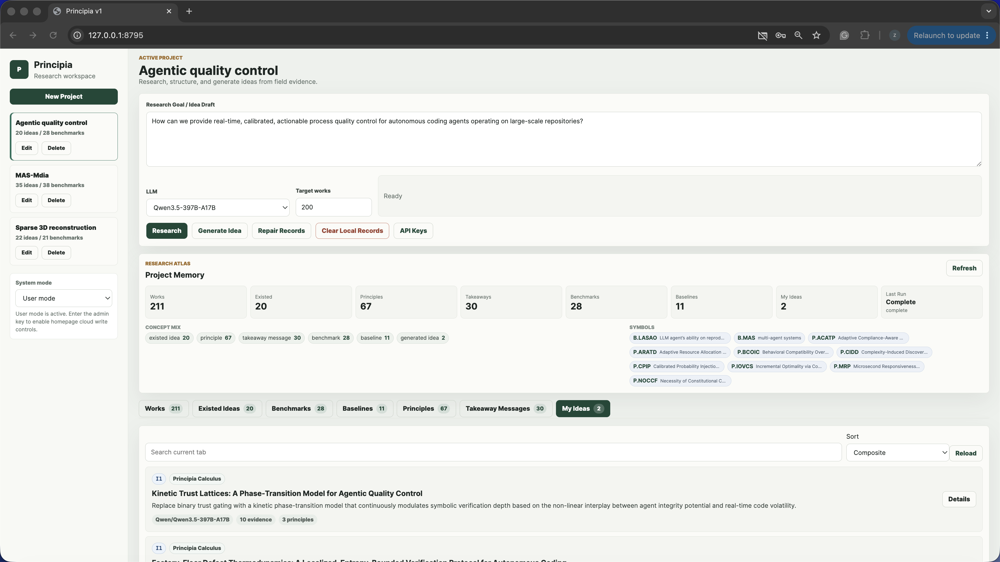
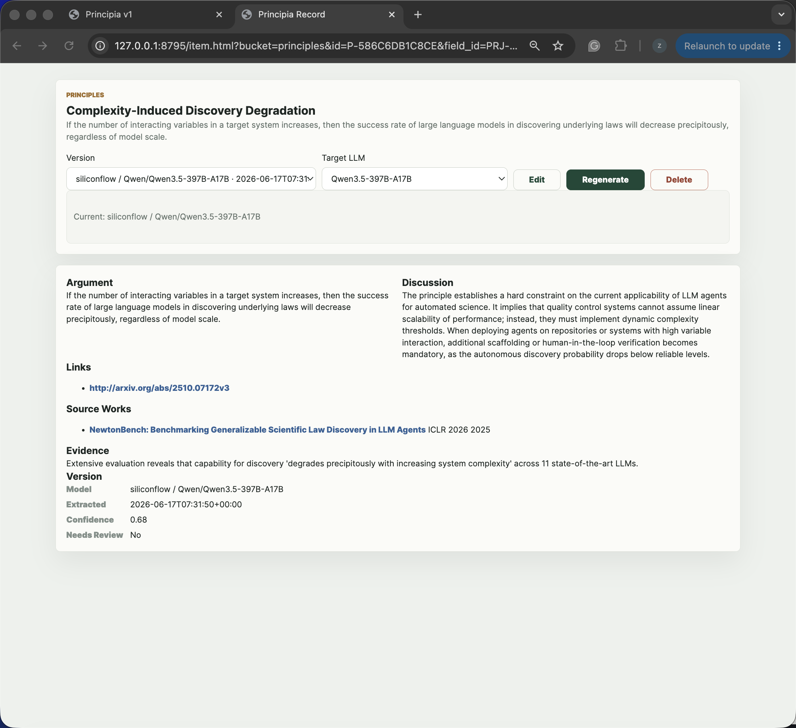
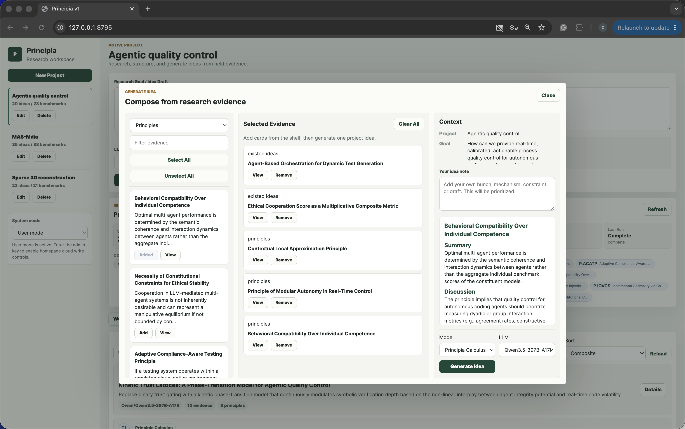
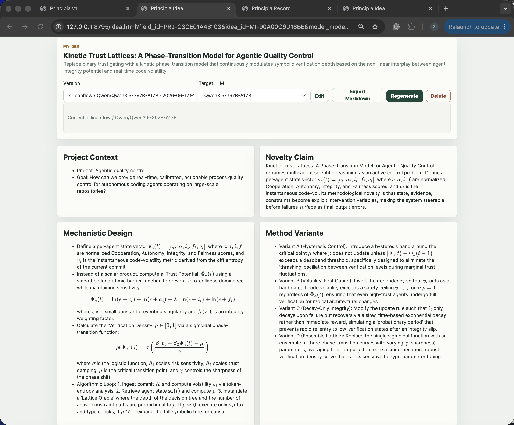
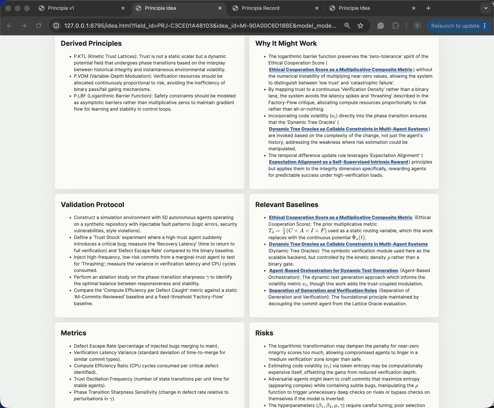
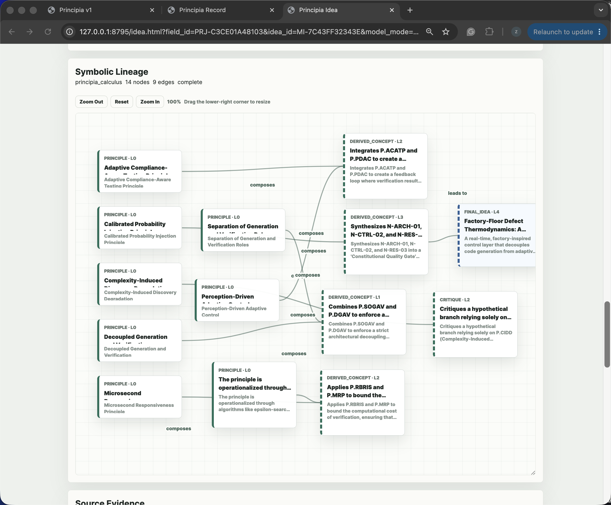
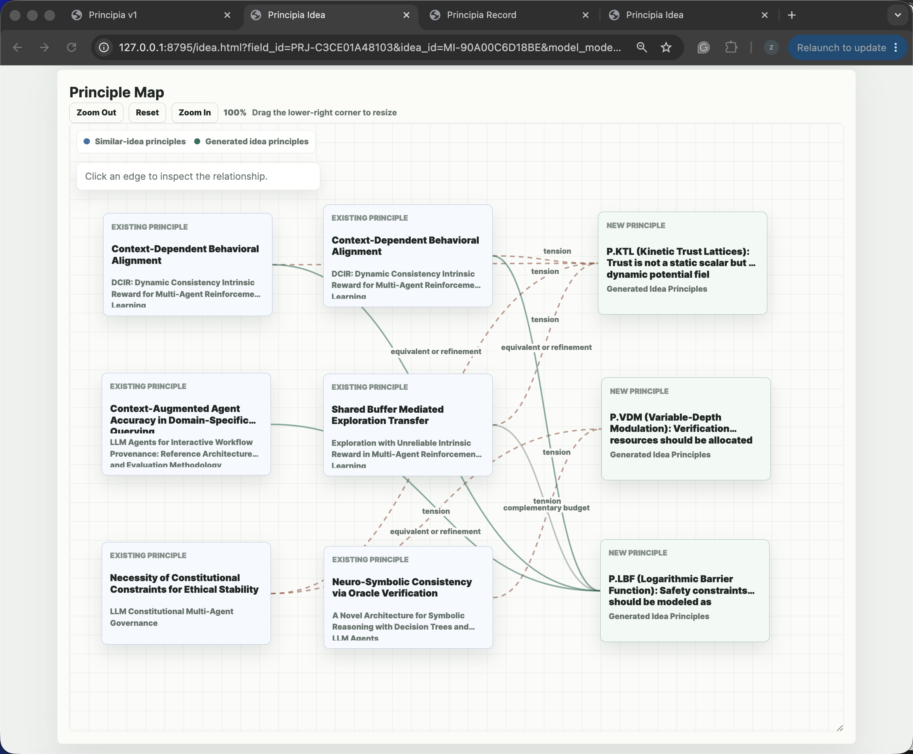
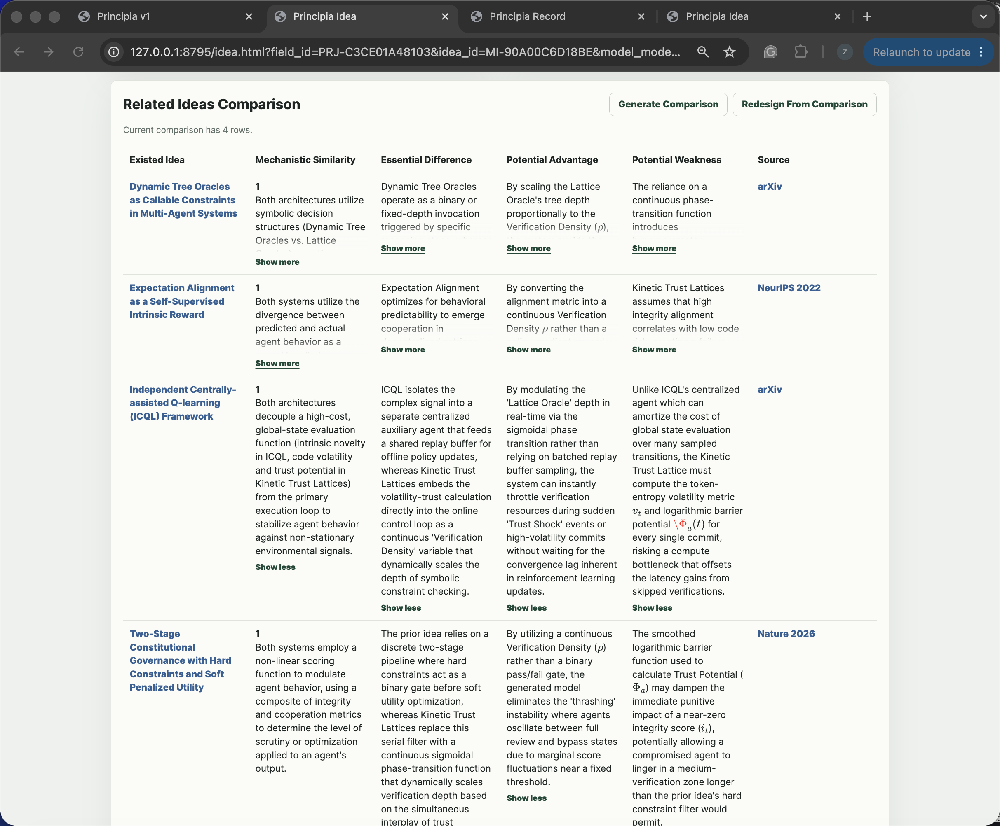
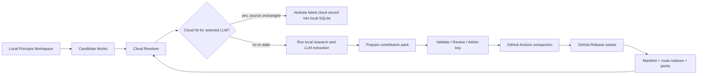
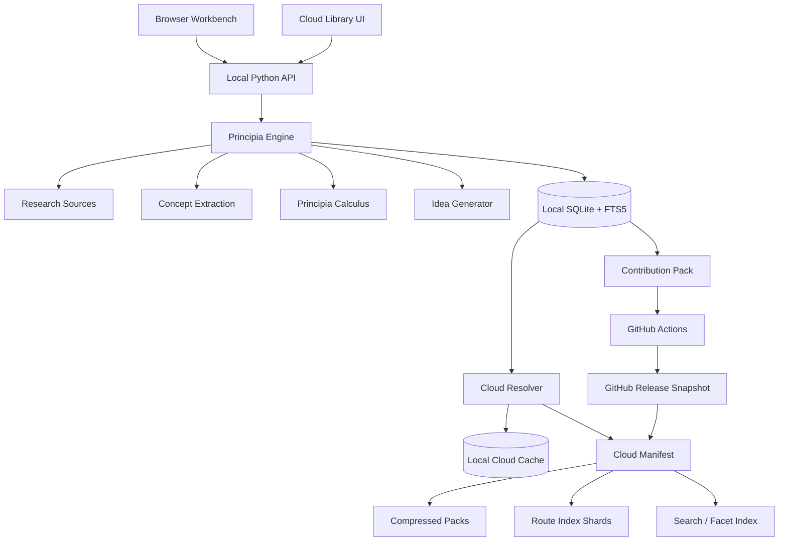

<h1 align="center">Principia</h1>

<p align="center">
  <b>Principle-First Automatic Idea Discovery System</b>
</p>

<p align="center">
  Turn research literature into reusable principles, compose evidence into traceable ideas, and inspect how every new hypothesis was formed.
</p>

<p align="center">
  <a href="https://github.com/pzqpzq/Principia"></a>
  
  
  
  
  
  
</p>

<p align="center">
  <a href="#why-principia">Why</a> ·
  <a href="#v11-at-a-glance">V1.1</a> ·
  <a href="#product-tour">Product Tour</a> ·
  <a href="#principia-cloud-library-v11">Cloud Library</a> ·
  <a href="#principia-calculus">Principia Calculus</a> ·
  <a href="#quick-start">Quick Start</a> ·
  <a href="#architecture">Architecture</a>
</p>

---

<p align="center">
  
</p>

<p align="center">
  <i>A local-first research workbench for moving from a rough goal to a lineage-backed Idea Card, with a GitHub-native Cloud Library for reusable research memory.</i>
</p>

---

## Why Principia

Most AI ideation tools stop at persuasive prose. Principia is designed for a stricter research standard: **ideas should have provenance**.

Principia converts research ideation from a black-box chat interaction into a structured, inspectable workflow:

```text
research goal
→ source works
→ existed ideas
→ principles
→ takeaway messages
→ benchmarks and baselines
→ symbolic derivations
→ traceable Idea Card
→ validation plan
→ reusable research memory
```

The central thesis:

> **A research idea is stronger when its principles, evidence, assumptions, risks, and validation path are visible.**

Principia is not merely a paper-search UI, a summarizer, or a brainstorming chatbot. It is the **principle, evidence, and validation layer** for research ideation.

---

## V1.1 at a glance

Principia V1.1 upgrades the V1.0 local research-memory foundation into a richer local + cloud system.

| Area | V1.0 foundation | V1.1 upgrade |
|---|---|---|
| Research memory | Normalized local SQLite memory across projects | GitHub-native Cloud Library with manifests, packs, route indexes, contribution packs, and release workflows |
| Idea generation | Standard generation + early Principia Calculus | Deeper symbolic derivation, richer idea-detail page, regeneration, related-idea comparison, principle map, and Markdown export |
| Paper reuse | Local extraction cache avoids repeated local work | Cloud resolver checks whether a paper/model version already exists before spending LLM calls |
| Concept reuse | Concept cards linked to works inside local memory | Cloud concept records can be deduplicated and referenced by many works, especially benchmarks, baselines, principles, and result facts |
| Cloud write path | Roadmap item | Admin-key gated local contribution/export flow, direct-push helper, GitHub Actions validation, compaction, and release publishing |
| Cloud discovery | Roadmap item | Cloud Library UI for crawling, queuing, researching, reviewing, syncing, and searching released records |
| Admin operations | Manual local edits | Cloud edit/delete/merge/split operations exported as auditable admin-operation records |

The product remains **local-first**: private goals, local API keys, local edits, and unpublished ideas stay on the user machine unless the user or maintainer explicitly exports them.

---

## Product tour

### 1. Project workspace and research memory

A project begins with a research goal, a target work count, an LLM selection, and a cancellable research workflow. Retrieved and extracted knowledge is organized into first-class tabs rather than buried in chat history.

<table>
  <tr>
    <td width="50%"></td>
    <td width="50%"></td>
  </tr>
  <tr>
    <td align="center"><b>Goal, controls, run status, and project memory</b></td>
    <td align="center"><b>Reusable existed ideas extracted from prior work</b></td>
  </tr>
</table>

### 2. Principle records and source-grounded extraction

Principia decomposes papers into structured objects: works, existed ideas, principles, takeaway messages, benchmarks, baselines, result facts, and evidence links. Records are written as objective, source-grounded research objects rather than loose summaries or author-voice paraphrases.

<table>
  <tr>
    <td width="50%"></td>
    <td width="50%"></td>
  </tr>
  <tr>
    <td align="center"><b>Principle library</b></td>
    <td align="center"><b>Evidence-backed principle card</b></td>
  </tr>
</table>

### 3. Evidence composition before generation

The evidence composer lets the user decide exactly which materials should influence an idea: works, existed ideas, principles, takeaways, benchmarks, and baselines.

<p align="center">
  
</p>

### 4. Traceable Idea Cards

Generated ideas are not just text blocks. Each Idea Card exposes project context, novelty claim, mechanistic design, method variants, derived principles, validation protocol, metrics, risks, and relevant baselines.

<table>
  <tr>
    <td width="50%"></td>
    <td width="50%"></td>
  </tr>
  <tr>
    <td align="center"><b>Idea thesis, novelty, and mechanism</b></td>
    <td align="center"><b>Derived principles, validation protocol, baselines, metrics, and risks</b></td>
  </tr>
</table>

### 5. Principia Calculus and principle maps

Principia Calculus gives the model a symbolic reasoning workspace before the final Idea Card is written. The user can inspect intermediate symbols, derivation nodes, speculative L0 supports, verifier transitions, and principle-to-idea relations.

<table>
  <tr>
    <td width="50%"></td>
    <td width="50%"></td>
  </tr>
  <tr>
    <td align="center"><b>Symbolic lineage graph</b></td>
    <td align="center"><b>Principle map with relation edges</b></td>
  </tr>
</table>

### 6. Related-idea comparison

Principia can compare a generated idea against related existed ideas, surfacing mechanistic similarity, essential differences, potential advantages, potential weaknesses, and source links.

<p align="center">
  
</p>

---

## Core capabilities

### Local-first research workspace

- Project-scoped goals, run status, selected materials, generated ideas, and memberships.
- Independent tabs for works, existed ideas, benchmarks, baselines, principles, takeaway messages, and user-generated ideas.
- Local SQLite memory with FTS-backed search.
- Cancellable research runs and repair/cleanup tools for keeping local records coherent.
- Included release database for immediate exploration.

### Source-grounded research ingestion

Principia can retrieve and process public academic metadata from free sources such as arXiv, OpenAlex, Crossref, and OpenReview-style venue records. During extraction, full paper text may be fetched transiently when available, but public cloud records are designed to store **metadata and extracted research-memory records rather than full paper text**.

Structured extraction targets include:

```text
Source Works
Existed Ideas
Principles
Takeaway Messages
Benchmarks
Baselines
Result Facts
Evidence Links
```

### Concept-level retrieval

Principia does not assume that an entire paper is relevant just because one concept inside the paper is relevant.

A single work may contain:

```text
relevant principle: yes
relevant existed idea: no
relevant takeaway: maybe
relevant benchmark: yes
```

So V1.1 retrieves concept cards independently by type, which makes idea generation more controllable and prevents a single related paper from flooding the prompt with irrelevant child records.

### Traceable idea generation

Generated ideas include:

- novelty claim;
- mechanistic design;
- method variants;
- derived principles;
- validation protocol;
- relevant baselines and metrics;
- source evidence;
- related-idea comparison;
- principle map;
- symbolic lineage graph;
- Markdown export.

### Quality and safety gates

Principia is deliberately conservative about failed or unsupported model output:

- no silent template fallback for failed online LLM calls;
- completed extraction batches are persisted before later-stage failures;
- cancellation is run-level, and late responses are not saved after cancellation;
- benchmarks and baselines should be official, concrete, and source-grounded;
- speculative symbolic nodes are marked separately rather than mixed with evidence-backed literature facts;
- public cloud packs are designed to avoid retaining full paper text;
- private `.env` files, API keys, runtime logs, SQLite WAL/SHM files, and local caches should not be committed.

---

## Principia Cloud Library V1.1

V1.1 introduces a GitHub-native Cloud Library: a serverless, static, versioned research-memory layer above the local workspace.

The design goal is practical: **use GitHub as the free distribution layer without pretending that GitHub is a conventional database server.**

### Cloud Library architecture



### What is stored in the cloud layer

The Cloud Library stores public research-memory records, not paper full text:

```text
work records
work versions
LLM extraction versions
concept records
concept versions
evidence snippets and source pointers
route indexes
search/facet indexes
contribution packs
admin operations
snapshot manifests
checksums
```

### Static cloud storage model

V1.1 uses static assets and local caching rather than per-paper API calls:

```text
cloud/manifests/latest.json          # pointer to the latest cloud snapshot
cloud/schema/*.schema.json           # public cloud record schemas
cloud/examples/*.json                # contribution and admin-operation examples
principia/cloud/*.py                 # pack, route-index, resolver, crawler, contribution, validator, compactor
.github/workflows/*.yml              # validate, compact, crawl, release
```

Generated cloud snapshots contain:

```text
manifest.json
stats.json
checksums.sha256
packs/pack-work-*.pcz
packs/pack-concept-*.pcz
indexes/work-route-index-*.sqlite.gz
indexes/concept-route-index-*.sqlite.gz
indexes/work-search-index.sqlite.gz
```

The current V1.1 implementation supports sharded work and concept route indexes, compressed pack files, manifest validation, search indexes, local cloud caches, and hydration of cloud hits into the local normalized memory.

### Why GitHub-native instead of a hosted database?

Principia V1.1 is designed to work without a separately deployed server:

- **GitHub Releases** can distribute snapshot assets such as manifests, route indexes, and compressed packs. GitHub documents release assets as supporting up to 1000 assets per release and each release asset under 2 GiB.
- **GitHub Pages** can host the static Cloud Library viewer for public repositories on GitHub Free.
- **GitHub Actions** validates contributions, compacts records, exports snapshots, and publishes release assets.
- The local client avoids treating the GitHub REST API as a database query path because GitHub REST requests have strict hourly rate limits.

References are listed at the end of this README.

### Cloud lookup during research

When a user asks Principia to research `N` candidate papers, V1.1 can resolve each candidate against the Cloud Library before invoking an LLM.

```text
candidate paper
→ normalize identity keys
→ resolve against cloud route indexes
→ check selected model key
→ compare source modified date / abstract hash / content signature
→ cloud hit: hydrate latest record locally
→ cloud miss or stale source: run local extraction
```

This reduces repeated LLM calls when multiple users or projects encounter the same already-extracted work.

### Versioning policy

Cloud extraction versions are keyed by paper and model lineage:

```text
work_id + model_key
```

A model key represents the provider, model, model mode, extraction prompt, schema version, and extraction task. For each `(work_id, model_key)`, V1.1 retains at most the latest three extraction versions:

```text
active version + two backups
```

This gives every LLM its own extraction lineage while bounding cloud growth.

### Contribution and upload modes

V1.1 supports two upload modes:

| Mode | Behavior |
|---|---|
| `normal` | Upload when the paper is not in cloud, the selected model version is missing, or the source appears newer/changed. |
| `force` | Admin-only overwrite path that updates the selected paper/model version while keeping recent backups according to the retention policy. |

The local upload flow prepares a contribution JSON file, validates public scope, records upload decisions, and either exports it for maintainer review or submits it through the maintainer direct-push path.

### Cloud Library UI

Open the local Cloud Library at:

```text
http://127.0.0.1:8792/cloud
```

The UI is organized as a four-step workflow:

```text
Discover → Research → Review → Sync
```

It includes:

- cloud snapshot stats;
- admin-mode status;
- venue/year/topic/priority-based paper crawling;
- queue management for candidate papers;
- LLM-scoped research tasks;
- unsynced local result tabs;
- cloud search over released records;
- venue/year/model/concept filters;
- admin edit/delete/merge/split operation export.

Supported venue choices include ICLR, NeurIPS, ICML, CVPR, ACL, ICCV, ECCV, EMNLP, AAAI, TPAMI, JMLR, Nature, Science, Nature Machine Intelligence, and Nature Computational Science. The crawler also normalizes aliases such as `NMI` and `NCS`.

### Included cloud snapshot

The uploaded V1.1 package includes a generated demonstration snapshot under `dist/cloud-live/`. In a normal repository workflow, generated cloud snapshots are usually published through GitHub Releases rather than committed as ordinary Git-tracked data.

To inspect a generated local cloud snapshot directly, point the manifest environment variable at it:

```bash
PRINCIPIA_CLOUD_MANIFEST_URL=dist/cloud-live/manifest.json \
  python3.12 principia.py cloud stats

PRINCIPIA_CLOUD_MANIFEST_URL=dist/cloud-live/manifest.json \
  python3.12 principia.py cloud manifest
```

---

## Principia Calculus

**Principia Calculus** is the symbolic ideation mode in Principia.

Standard generation writes an Idea Card directly from selected evidence. Principia Calculus instead builds an intermediate reasoning workspace:

```text
retrieved concepts
→ compact symbols
→ derivation patches
→ verifier checks
→ speculative L0 nodes
→ lineage graph
→ final Idea Card
```

Example symbolic flow:

```text
P.ATCU  = Adaptive token/compute routing under uncertainty
P.EFB   = Evaluator-first binding
TM.ROH  = Routing overhead can erase gains

D.EVR   = compose(P.ATCU, P.EFB)
D.COST  = stress_test(D.EVR, TM.ROH)
I.EVRA  = specialize(D.COST, research-agent ideation)
```

The result is an idea page where the user can inspect not only the final idea, but also the layered derivation process that produced it.

Principia Calculus is designed for three goals:

1. **Depth** — allow intermediate symbolic concepts before finalizing an idea.
2. **Token efficiency** — reuse compact symbolic handles for repeated mechanisms.
3. **Explainability** — expose an idea's construction as a graph rather than hidden prose.

Principia's symbolic direction is related to the Language Symbolism Framework idea introduced in the ICML 2026 paper [“When LLMs Develop Languages: Symbolic Communication for Efficient Multi-Agent Reasoning”](https://icml.cc/virtual/2026/poster/61557).

---

## Data model

Principia V1.1 keeps local work and cloud memory separated but compatible.

### Local normalized memory

```text
global_work
work_version
extraction_run
concept_card
concept_version
evidence_link
symbol_registry
derivation_run
derivation_node
derivation_edge
project_record_membership
run_event
embedding_index
migration_status
cloud_asset_cache
cloud_manifest_cache
cloud_payload_cache
cloud_route_shard_cache
cloud_upload_log
```

### Cloud record families

```text
CloudWorkRecord
CloudConceptRecord
CloudRelationRecord
CloudContribution
CloudAdminOperation
CloudManifest
RouteIndexShard
SearchIndex
CompressedPack
```

### Concept independence and shared references

Many papers can point to the same benchmark, baseline, principle, or result fact. V1.1's cloud compaction layer can deduplicate concept records by canonical key and alias structure, then rewrite work evidence to point to the canonical shared concept.

This is especially important for:

```text
benchmarks
baselines
evaluation suites
widely reused mechanisms
common failure modes
repeated takeaway messages
```

---

## Research workflow

### 1. Create or open a project

Each project stores its own goal, selected works, memberships, generated ideas, and run status. Multiple projects can be managed independently.

### 2. Run research

Principia retrieves relevant works, stores paper metadata, and extracts structured information from selected works. The research output is organized into:

```text
Works
Existed Ideas
Benchmarks
Baselines
Principles
Takeaway Messages
My Ideas
```

### 3. Compose from evidence

Open the evidence composer and select exactly the works or concept cards that should influence generation.

### 4. Generate an idea

Choose one of two generation modes:

| Mode | Best for | Behavior |
|---|---|---|
| Standard | Fast, direct idea generation | Synthesizes a full Idea Card from selected evidence. |
| Principia Calculus | Deeper, inspectable ideation | Builds symbols, verifies derivation patches, stores lineage nodes and edges, then writes the final Idea Card. |

### 5. Inspect, compare, regenerate, and export

Open the generated idea page to inspect novelty, mechanism, validation protocol, risks, related existed ideas, principle map, symbolic lineage, and source evidence. The idea can be manually edited, regenerated with another model, redesigned from comparison, or exported as Markdown.

### 6. Contribute to cloud when appropriate

If a paper/model extraction is new or stale relative to the Cloud Library, an admin or maintainer can prepare a contribution pack and publish it through the GitHub-native cloud workflow.

---

## Quick start

Principia requires **Python 3.9+**. Python **3.12** is recommended.

```bash
git clone https://github.com/pzqpzq/Principia.git
cd Principia

python3.12 -m pip install -r requirements.txt
cp .env.example .env

python3.12 principia.py serve --host 127.0.0.1 --port 8792
```

Open:

```text
http://127.0.0.1:8792/
```

The runtime intentionally relies on the Python standard library. Install `pypdf` separately only if you need PDF-specific tests or ingestion paths.

---

## LLM and cloud configuration

Put private keys only in `.env`. Do not commit `.env` or any file containing secrets.

```text
SILICONFLOW_API_KEY=your_siliconflow_key_here
OPENAI_API_KEY=your_openai_key_here

PRINCIPIA_LLM_BASE_URL=https://api.siliconflow.cn/v1
PRINCIPIA_OPENAI_BASE_URL=https://api.openai.com/v1

PRINCIPIA_REQUEST_TIMEOUT=180
PRINCIPIA_SLOW_REQUEST_TIMEOUT=420
PRINCIPIA_COST_LIMIT_CNY=1000
PRINCIPIA_SSL_VERIFY=1

PRINCIPIA_CLOUD_MANIFEST_URL=
PRINCIPIA_CLOUD_ADMIN_KEY=
PRINCIPIA_CLOUD_ADMIN_KEY_SHA256=
```

Cloud admin configuration is intentionally server-side/local. The browser should never contain a hard-coded shared secret.

---

## CLI

Start the local app:

```bash
python3.12 principia.py serve --host 127.0.0.1 --port 8792
```

Inspect local normalized memory:

```bash
python3.12 principia.py state --v1
```

Run project research:

```bash
python3.12 principia.py research "efficient LLM research agents" --target-works 100
```

Retrieve concept cards independently:

```bash
python3.12 principia.py retrieve "adaptive compute routing" --types principle,takeaway_message,benchmark
```

Generate through Principia Calculus:

```bash
python3.12 principia.py generate "new idea for agent memory" --mode principia-calculus
```

Inspect symbols and lineage:

```bash
python3.12 principia.py symbols --namespace global
python3.12 principia.py lineage MI-...
```

Export a report:

```bash
python3.12 principia.py export "agent memory" --format markdown
```

### Cloud commands

```bash
# Inspect the active cloud manifest and local cloud cache.
# When cloud/manifests/latest.json already points at a published release, no env override is needed.
# For a local generated snapshot, point the client directly at the manifest:
export PRINCIPIA_CLOUD_MANIFEST_URL=dist/cloud-live/manifest.json

python3.12 principia.py cloud stats
python3.12 principia.py cloud manifest --refresh

# Resolve candidate papers against the selected cloud model version.
python3.12 principia.py cloud resolve \
  --input candidates.json \
  --model-key provider:model:model_mode:principia-work-extract-v1:principia-cloud-1.1:work_concepts

# Search/prefetch released cloud records.
python3.12 principia.py cloud prefetch --query "test-time scaling" --limit 50

# Export local SQLite memory as release-ready cloud assets.
python3.12 principia.py cloud export-snapshot --out dist/cloud

# Prepare and submit a cloud contribution.
python3.12 principia.py cloud upload --prepare --mode normal --model-key <model-key>
python3.12 principia.py cloud upload data/artifacts/cloud/contributions/CONTRIB_....json

# Validate and compact cloud contributions.
python3.12 principia.py cloud validate-contribution cloud/examples/contribution.example.json
python3.12 principia.py cloud compact --input cloud/contributions --out dist/cloud-compaction

# Build an admin crawler plan.
python3.12 principia.py cloud crawl \
  --venues ICLR,NeurIPS,ICML \
  --years 2024-2026 \
  --topics "test-time scaling, multimodal agents" \
  --max-papers 100 \
  --dry-run
```

---

## API surface

### Core local API

```text
POST /api/v1/research/start
GET  /api/v1/research/status
POST /api/v1/research/cancel

GET  /api/v1/projects
GET  /api/v1/project/tab

GET  /api/v1/item/detail
POST /api/v1/item/update
POST /api/v1/item/refresh/start

POST /api/v1/retrieve-concepts

POST /api/v1/ideas/standard-generate
POST /api/v1/ideas/symbolic-generate
GET  /api/v1/ideas/{idea_id}/lineage

GET  /api/v1/symbols/table
GET  /api/v1/symbols/expand

POST /api/v1/feedback/ingest
```

### Cloud API

```text
GET  /api/v1/cloud/manifest
GET  /api/v1/cloud/stats
GET  /api/v1/cloud/local/summary
GET  /api/v1/cloud/local/tab
GET  /api/v1/cloud/admin/status
GET  /api/v1/cloud/upload/status
GET  /api/v1/cloud/work/{work_id}
GET  /api/v1/cloud/concept/{concept_id}

POST /api/v1/cloud/resolve
POST /api/v1/cloud/prefetch
POST /api/v1/cloud/search
POST /api/v1/cloud/hydrate
POST /api/v1/cloud/upload/record
POST /api/v1/cloud/upload/prepare
POST /api/v1/cloud/upload/submit

POST /api/v1/cloud/local/queue/add
POST /api/v1/cloud/local/queue/remove
POST /api/v1/cloud/local/queue/clear
POST /api/v1/cloud/local/tasks/add
POST /api/v1/cloud/local/tasks/add-all
POST /api/v1/cloud/local/tasks/remove
POST /api/v1/cloud/local/tasks/clear
POST /api/v1/cloud/local/cleanup
POST /api/v1/cloud/local/mark-synced

POST /api/v1/cloud/admin/crawl/plan
POST /api/v1/cloud/admin/crawl/run
POST /api/v1/cloud/admin/edit
POST /api/v1/cloud/admin/delete
POST /api/v1/cloud/admin/merge-concepts
POST /api/v1/cloud/admin/split-concept
```

Temporary `/api/v2/*` aliases remain for compatibility while older detail and assembler flows are fully migrated.

---

## Architecture



---

## Repository layout

```text
.
├── principia/                         # Core Python package
│   ├── cli.py                         # CLI commands
│   ├── server.py                      # Local web server and API routes
│   ├── engine.py                      # Research, extraction, retrieval, generation, repair logic
│   ├── global_store.py                # Normalized research memory operations
│   ├── schema.py                      # SQLite schema and FTS setup
│   ├── symbolic_ideator.py            # Principia Calculus generation
│   ├── derivation_verifier.py         # Symbolic derivation checks
│   ├── research_sources.py            # arXiv/OpenAlex/Crossref metadata search
│   └── cloud/                         # V1.1 Cloud Library implementation
│       ├── manifest.py                # Manifest pointer and validation-aware loading
│       ├── pack.py                    # Compressed pack read/write
│       ├── route_index.py             # Sharded work/concept route indexes
│       ├── resolver.py                # Batch cloud lookup and cache-hit decisions
│       ├── hydrate.py                 # Cloud-to-local SQLite hydration
│       ├── contribution.py            # Contribution pack export and upload decisions
│       ├── compactor.py               # Snapshot export and contribution compaction
│       ├── crawler.py                 # Venue/topic/year crawler planning
│       ├── github_client.py           # Maintainer direct-push and release helpers
│       ├── search.py                  # Cloud search and facet search
│       ├── validator.py               # Manifest/contribution validation
│       └── auth.py                    # Admin-key and session authorization
├── static/                            # Browser UI
│   ├── index.html / app.js / styles.css
│   ├── idea.html / idea.js
│   ├── cloud.html / cloud.js / cloud.css
│   └── item.html / item.js
├── cloud/
│   ├── schema/                        # Public cloud JSON schemas
│   ├── examples/                      # Contribution and admin-operation examples
│   └── manifests/latest.json          # Latest snapshot pointer
├── .github/workflows/
│   ├── principia-cloud-validate.yml
│   ├── principia-cloud-compact.yml
│   ├── principia-cloud-crawl.yml
│   └── principia-cloud-release.yml
├── data/
│   ├── principia.sqlite               # Included local demo/release database
│   └── artifacts/                     # Runtime exports, contribution packs, local artifacts
├── docs/screenshots/                  # README screenshots
├── legacy/                            # Archived older demo/release code
├── tests/
│   ├── test_principia_v1.py
│   └── test_cloud_v1_1.py
├── principia.py                       # CLI entrypoint
├── requirements.txt
└── principia_v1_1_github_cloud_design_proposal.md
```

Generated cloud snapshots under `dist/cloud*` are build artifacts. They should usually be uploaded to GitHub Releases, not committed directly as ordinary repository data.

---

## Testing and validation

Run the regression suite:

```bash
python3.12 -m unittest discover -s tests -v
```

Install optional PDF support before PDF-specific tests or ingestion:

```bash
python3.12 -m pip install pypdf
```

The included suites cover:

```text
schema creation and migration
work identity and versioning
model-specific extraction cache behavior
quality gates and JSON repair
FTS search and concept retrieval
benchmark/baseline extraction contracts
Principia Calculus symbolic generation
lineage graph and principle map rendering
related-idea comparison
Markdown export
research cancellation and stale-run recovery
Cloud Library schemas and route indexes
cloud resolver hydration and cache-hit decisions
contribution validation and public-scope checks
cloud compaction and release-ready snapshot generation
crawler planning, venue normalization, and topic filtering
cloud queue, research-task, sync, and cleanup flows
```

The synthetic 100k-record cloud snapshot test is opt-in:

```bash
PRINCIPIA_RUN_SCALE_TESTS=1 python3.12 -m unittest tests.test_cloud_v1_1 -v
```

---

## Security, privacy, and research integrity

Principia is designed as a research instrument, not a paper mill.

- Private projects stay local unless explicitly exported.
- Cloud records should store metadata, evidence snippets, extracted concepts, and source pointers rather than paper full text.
- Admin keys belong in the local/server environment, never in browser code.
- Generated ideas must expose source evidence, prior-art overlap, assumptions, and risks.
- Speculative symbolic nodes must remain distinguishable from evidence-backed literature facts.
- Failed extractions should not be replaced by fake template content.
- No auto-submission to conferences or journals.
- Source attribution should preserve DOI, arXiv, OpenAlex, OpenReview, Semantic Scholar, Crossref, and source URLs when available.

Before publishing, verify that `.env`, `.sqlite-wal`, `.sqlite-shm`, logs, cached PDFs, and private artifacts are not committed.

---

## Roadmap

V1.1 establishes the local + GitHub-native cloud foundation. Natural next steps:

- stronger cloud semantic search with local vector shards;
- richer concept merge/split review UI;
- release-level moderation and validation reports;
- shareable public Idea Cards;
- Codex prompt-pack and skill export for validation workflows;
- MCP/assistant integration;
- predicted-vs-observed result calibration;
- public benchmark suite for principle-grounded ideation;
- collaborative public Principle Graph.

---

## References

- [GitHub Releases: storage and bandwidth quotas](https://docs.github.com/en/repositories/releasing-projects-on-github/about-releases)
- [GitHub Pages: availability for public repositories on GitHub Free](https://docs.github.com/pages/quickstart)
- [GitHub REST API rate limits](https://docs.github.com/en/rest/using-the-rest-api/rate-limits-for-the-rest-api)
- [ICML 2026: “When LLMs Develop Languages: Symbolic Communication for Efficient Multi-Agent Reasoning”](https://icml.cc/virtual/2026/poster/61557)

---

## Contact

Business collaboration: [peizhengqi@chipflow.net](mailto:peizhengqi@chipflow.net)  
Academic collaboration: [peizhengqi22@mails.ucas.ac.cn](mailto:peizhengqi22@mails.ucas.ac.cn)

---

<p align="center">
  <b>Principia: ideas from principles, validated by evidence.</b>
</p>
