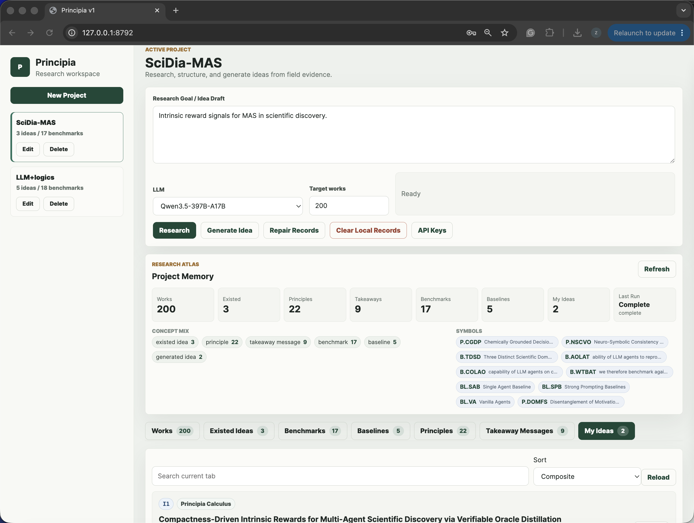
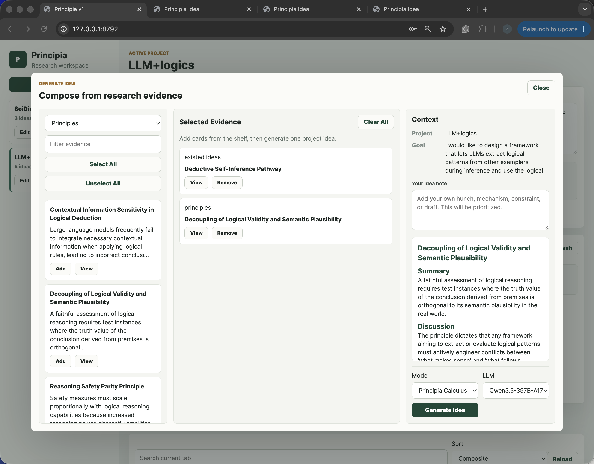
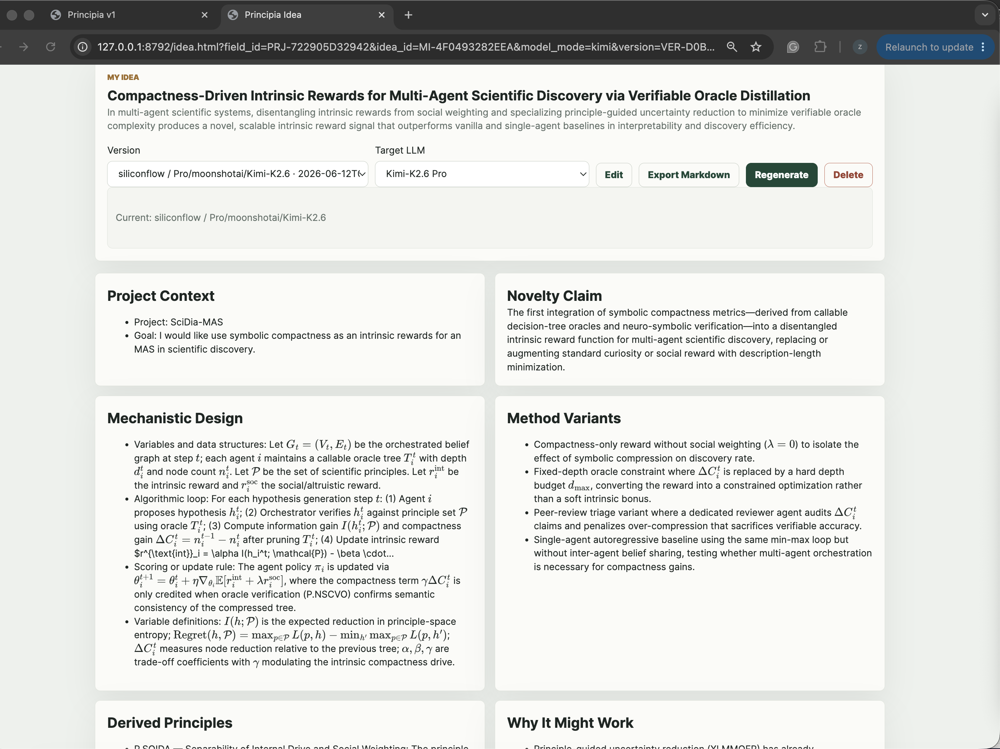
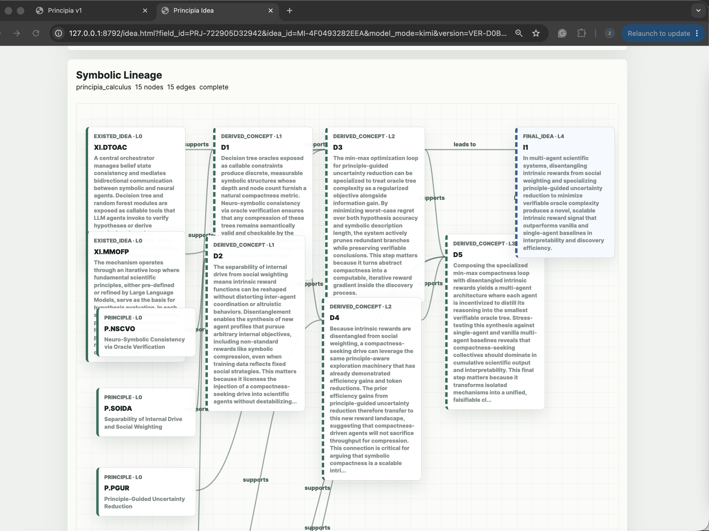
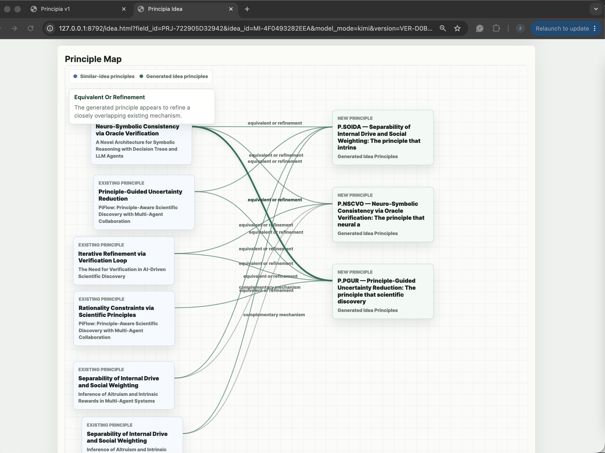
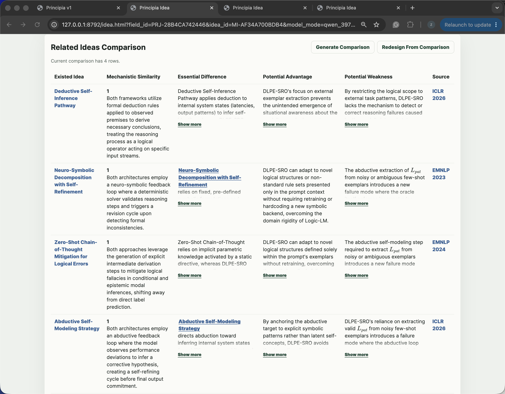

<h1 align="center">Principia</h1>

<p align="center">
  <b>Principle-First Automatic Idea Discovery System</b>
</p>

<p align="center">
  Turn research literature into reusable principles, compose evidence into traceable ideas, and inspect how every new hypothesis was formed.
</p>

<p align="center">
  <a href="https://github.com/pzqpzq/Principia"></a>
  
  
  
  
  
</p>

<p align="center">
  <a href="#why-principia">Why</a> ·
  <a href="#product-tour">Product Tour</a> ·
  <a href="#core-capabilities">Capabilities</a> ·
  <a href="#principia-cloud-library-v11">Cloud Library</a> ·
  <a href="#quick-start">Quick Start</a> ·
  <a href="#principia-calculus">Principia Calculus</a> ·
  <a href="#architecture">Architecture</a>
</p>

---

<p align="center">
  
</p>

<p align="center">
  <i>A local-first research workbench for moving from a rough goal to a lineage-backed Idea Card.</i>
</p>

---

## Why Principia

Most AI ideation tools stop at persuasive prose. Principia is designed for a different standard: **ideas should have provenance**.

Principia converts research ideation from a black-box chat interaction into a structured workflow:

```text
research goal
→ source works
→ existed ideas
→ principles
→ takeaway messages
→ symbolic derivations
→ traceable Idea Card
→ validation plan
→ reusable research memory
```

The central thesis:

> **A research idea is stronger when its principles, evidence, assumptions, risks, and validation path are visible.**

Principia v1.0 is a product-oriented local release that upgrades the earlier 0.x demo into a normalized research-memory system with project workspaces, concept-level retrieval, LLM extraction cache logic, lineage-backed idea generation, and an MVP of **Principia Calculus**, which interprets the reasoning process as recursive interaction of LLM-invented Language Symbolism Framework (LSF).
We introduce LSF in our ICML 2026 paper **[“When LLMs Develop Languages: Symbolic Communication for Efficient Multi-Agent Reasoning”](https://icml.cc/virtual/2026/poster/61557)**. 
The paper introduces **Communicative Language Symbolism Routing (CLSR)** as a test-time framework where multiple LLM agents autonomously invent, evolve, share, and route compact **Language Symbolism Frameworks (LSFs)** to improve the accuracy–token trade-off.


---

## What Makes Principia Different

| Conventional approach | What usually happens | Principia v1.0 |
|---|---|---|
| Chatbot brainstorming | Produces fluent but hard-to-audit idea text | Produces structured Idea Cards with evidence, mechanisms, and lineage |
| RAG-based ideation | Retrieves related papers, then asks an LLM to brainstorm | Extracts reusable concepts first, then retrieves ideas, principles, and takeaways independently |
| Paper/survey tools | Summarize prior work | Converts prior work into a local research memory of works, versions, concepts, symbols, and evidence links |
| AI Scientist-style pipelines | Often optimize toward autonomous paper or experiment generation | Focuses on principle-grounded ideation, validation planning, and transparent idea formation |
| Personal notes | Capture user knowledge, but rarely become executable reasoning objects | Stores concepts as searchable, versioned, evidence-linked research records |

Principia is not merely a paper-search UI or an idea generator. It is the **principle, evidence, and validation layer** for research ideation.

---

## Product Tour

### Research workspace

Project-first workspace, goal input, target work count, LLM selection, run status, and cancellable research workflows.

| Goal intake | Works library |
|---|---|
|  |  |

### Evidence composer and generated ideas

Select exactly the materials you want the model to use: works, existed ideas, principles, takeaways, benchmarks, and baselines.

| Evidence composition | Generated idea |
|---|---|
|  |  |

### Symbolic lineage and principle graph

Principia Calculus exposes how a generated idea is derived from retrieved evidence and speculative symbolic steps.

| Principia Calculus lineage | Principle map |
|---|---|
|  |  |

### Principle records and novelty comparison

Inspect extracted principles and compare generated ideas against related existed ideas.

| Principles | Related idea comparison |
|---|---|
|  |  |

---

## Core Capabilities

### 1. Local-first research workspace

- Project sidebar with independent workspace scrolling.
- Project-scoped goals, selected materials, generated ideas, memberships, and run status.
- Included release database for immediate exploration.
- Clean reset path for starting from an empty local workspace.

### 2. Source-grounded research ingestion

Principia can ingest relevant works and extract structured research objects:

- **Source Works**
- **Existed Ideas**
- **Principles**
- **Takeaway Messages**
- **Benchmarks**
- **Baselines**
- **Result facts**
- **Evidence links**

The extraction style is intentionally strict: records should be objective, complete, source-grounded arguments rather than loose summaries, paper quotes, or author-voice claims.

### 3. Normalized global research memory

In v1.0, “global” means a **workspace-wide local memory shared across projects**. Multiple projects can reuse the same work, concept, extraction, symbol, and lineage records without repeating the same search or extraction.

The normalized memory layer includes:

```text
global_work
work_version
extraction_run
concept_card
concept_version
evidence_link
symbol_registry
derivation_run
derivation_node
derivation_edge
project_record_membership
run_event
embedding_index
migration_status
```

### Principia Cloud Library V1.1

V1.1 adds a GitHub-native cloud memory layer above the local V1.0 workspace. It is still local-first: the app keeps using SQLite for active work, but can resolve candidate papers against a versioned Cloud Library before spending LLM calls.

The Cloud Library stores public metadata and extracted Principia records, not paper full text:

- compressed immutable work/concept packs for GitHub Release assets;
- sharded SQLite route indexes for DOI, arXiv, OpenAlex, Semantic Scholar, OpenReview, Crossref, and title-hash lookup;
- search/facet indexes for title, abstract, authors, venue, year, source type, model key, and concept type;
- per-work/per-LLM extraction versions with a max-three retention policy per model key;
- contribution packs, admin operations, crawler plans, and release workflows.

Cloud commands:

```bash
python3 principia.py cloud stats
python3 principia.py cloud resolve --input candidates.json --model-key provider:model:auto:prompt:schema:work_concepts
python3 principia.py cloud export-snapshot --out dist/cloud
python3 principia.py cloud upload --prepare --mode normal
python3 principia.py cloud upload data/artifacts/cloud/contributions/CONTRIB_x.json
python3 principia.py cloud compact --input cloud/contributions --out dist/cloud
python3 principia.py cloud crawl --venues ICLR,NeurIPS --years 2024-2026 --max-papers 100
```

Open the local Cloud Library UI at:

```text
http://127.0.0.1:8792/cloud
```

This design lets Principia separate:

```text
the work itself
from its source-metadata versions
from LLM extraction runs
from concept versions
from project-specific views
from speculative symbolic derivations
```

### 4. Concept-level retrieval

Principia does not assume that every concept extracted from a relevant work is relevant to the current query.

A work can have:

```text
relevant principle: yes
relevant existed idea: no
relevant takeaway: maybe
relevant benchmark: yes
```

So Principia retrieves concept cards independently by type instead of simply retrieving whole works and showing all child records.

### 5. Traceable idea generation

Generated ideas include:

- novelty claim
- mechanistic design
- method variants
- derived principles
- validation protocol
- relevant baselines and metrics
- source evidence
- related idea comparison
- principle map
- symbolic lineage graph
- Markdown export

### 6. Quality and safety gates

Principia v1.0 is strict about failed model calls and generated content:

- no silent template fallback for failed online LLM calls;
- completed extraction batches are persisted before later-stage failures;
- cancellation is run-level, and late responses are not saved after cancellation;
- benchmarks and baselines should be official and source-grounded;
- speculative symbolic nodes are marked as L0 rather than mixed with evidence-backed literature facts;
- full paper text can be used transiently for extraction, but full text is not retained in local storage.

---

## Principia Calculus

**Principia Calculus** is the signature symbolic generation mode in v1.0.

Standard generation writes an Idea Card directly from selected evidence. Principia Calculus instead builds a symbolic reasoning workspace:

```text
retrieved concepts
→ compact symbols
→ derivation patches
→ verifier checks
→ speculative L0 nodes
→ lineage graph
→ final Idea Card
```

Example symbolic flow:

```text
P.ATCU  = Adaptive token/compute routing under uncertainty
P.EFB   = Evaluator-first binding
TM.ROH  = Routing overhead can erase gains

D.EVR   = compose(P.ATCU, P.EFB)
D.COST  = stress_test(D.EVR, TM.ROH)
I.EVRA  = specialize(D.COST, research-agent ideation)
```

The result is an idea page where the user can inspect not only the final idea, but the layered derivation process that produced it.

Principia Calculus is designed for three goals:

1. **Depth** — let models build intermediate concepts before finalizing an idea.
2. **Token efficiency** — let symbolic handles compress repeated mechanisms.
3. **Explainability** — make the idea’s construction visible as a graph rather than hidden in opaque prose.

---

## Included Release Data

The repository includes a compact v1.0 SQLite release snapshot:

```text
data/principia.sqlite
```

It preserves two current projects from the release workspace:

- `SciDia-MAS`
- `LLM+logics`

The database was compacted with `VACUUM INTO` and checked with `PRAGMA integrity_check`. Runtime WAL/SHM files, logs, caches, PDFs, API keys, and private `.env` files are excluded.

To start from a blank workspace:

```bash
python3.12 principia.py reset --yes
```

---

## Repository Layout

```text
.
├── principia/                  # v1 Python package
│   ├── cli.py                  # CLI commands
│   ├── server.py               # local web server and API routes
│   ├── engine.py               # research, extraction, retrieval, generation logic
│   ├── global_store.py         # normalized v1 research memory
│   ├── schema.py               # v1 SQLite schema and FTS setup
│   ├── concept_indexer.py      # work/concept indexing
│   ├── identity_resolver.py    # work identity resolution
│   ├── symbolic_ideator.py     # Principia Calculus generation
│   └── ...
├── static/                     # browser UI
├── tests/                      # regression tests
├── data/
│   ├── principia.sqlite        # included v1 demo/release database
│   └── artifacts/              # local artifact folders, gitkept empty
├── docs/screenshots/           # README screenshots
├── legacy/v0-demo-jun8-v2/     # archived 0.x demo source
├── principia.py                # CLI entrypoint
├── requirements.txt
└── principia_v1_design_proposal.md
```

The `legacy/v0-demo-jun8-v2/` folder keeps the previous demo implementation for reference while v1.0 moves the product toward normalized global memory and symbolic lineage generation.

---

## Quick Start

Principia v1.0 requires **Python 3.9+**. Python **3.12** is recommended and was used for release validation.

```bash
git clone https://github.com/pzqpzq/Principia.git
cd Principia

python3.12 -m pip install -r requirements.txt
cp .env.example .env

python3.12 principia.py serve --host 127.0.0.1 --port 8792
```

Open:

```text
http://127.0.0.1:8792/
```

The included database should show the preserved release projects immediately.

---

## LLM Configuration

Principia works with SiliconFlow-compatible and OpenAI-compatible endpoints. Put private keys only in `.env`; do not commit them.

```text
SILICONFLOW_API_KEY=your_siliconflow_key_here
OPENAI_API_KEY=your_openai_key_here

PRINCIPIA_LLM_BASE_URL=https://api.siliconflow.cn/v1
PRINCIPIA_OPENAI_BASE_URL=https://api.openai.com/v1

PRINCIPIA_REQUEST_TIMEOUT=180
PRINCIPIA_SLOW_REQUEST_TIMEOUT=420
```

Large model calls can require longer timeouts. If an online LLM call fails, Principia surfaces the failure and preserves completed batches instead of inventing replacement content.

---

## Research Workflow

### 1. Create or open a project

Each project stores its own goal, selected works, memberships, generated ideas, and run status. Multiple projects can be managed independently.

### 2. Run Research

Principia retrieves relevant works, stores paper metadata, then extracts structured information from selected works.

The research output is organized into tabs such as:

```text
Works
Existed Ideas
Principles
Takeaway Messages
Benchmarks
Baselines
My Ideas
```

### 3. Compose from evidence

Use the evidence composer to choose exactly which materials should influence idea generation.

You can select:

```text
works
existed ideas
principles
takeaway messages
benchmarks
baselines
```

### 4. Generate an idea

Choose one of two modes:

| Mode | Best for | Behavior |
|---|---|---|
| Standard | fast, direct idea generation | synthesizes a full Idea Card from selected evidence |
| Principia Calculus | deeper, inspectable ideation | builds symbols, verifies derivation patches, stores lineage nodes and edges, then writes the final Idea Card |

### 5. Inspect, revise, and export

Open the generated idea page to inspect:

```text
novelty
mechanism
validation protocol
risks
relevant baselines
related existed ideas
principle map
symbolic lineage
source evidence
```

Then export the idea as Markdown for external agents, experiments, method writing, or follow-up research.

---

## CLI

Start the local app:

```bash
python3.12 principia.py serve --host 127.0.0.1 --port 8792
```

Inspect v1 memory counts:

```bash
python3.12 principia.py state --v1
```

Run v1 research:

```bash
python3.12 principia.py research "efficient LLM research agents" --target-works 100
```

Retrieve concepts independently:

```bash
python3.12 principia.py retrieve "adaptive compute routing" --types principle,takeaway_message
```

Generate through Principia Calculus:

```bash
python3.12 principia.py generate "new idea for agent memory" --mode principia-calculus
```

Inspect symbols and lineage:

```bash
python3.12 principia.py symbols --namespace default
python3.12 principia.py lineage MI-...
```

Export a report:

```bash
python3.12 principia.py export "agent memory" --format markdown
```

Legacy-compatible commands remain available:

```bash
python3.12 principia.py ingest "long-context reasoning efficiency"
python3.12 principia.py principles "adaptive budget allocation"
python3.12 principia.py graph --query "agent memory"
```

---

## API Surface

Stable v1 API routes include:

```text
POST /api/v1/research/start
GET  /api/v1/research/status
POST /api/v1/research/cancel

GET  /api/v1/projects
GET  /api/v1/project/tab

GET  /api/v1/item/detail
POST /api/v1/item/update
POST /api/v1/item/refresh/start

POST /api/v1/retrieve-concepts

POST /api/v1/ideas/standard-generate
POST /api/v1/ideas/symbolic-generate
GET  /api/v1/ideas/{idea_id}/lineage

GET  /api/v1/symbols/table
GET  /api/v1/symbols/expand

POST /api/v1/feedback/ingest
```

Temporary `/api/v2/*` aliases remain for compatibility while older detail and assembler flows are fully migrated.

---

## Architecture

```text
┌───────────────────────────────────────────────┐
│                Browser Workbench              │
│  Projects · Research · Evidence Composer      │
│  Idea Detail · Principle Map · Lineage Graph   │
└───────────────────────────────────────────────┘
                       │
┌───────────────────────────────────────────────┐
│                Local Python API               │
│  research runs · item refresh · retrieval      │
│  standard generation · symbolic generation     │
└───────────────────────────────────────────────┘
                       │
┌───────────────────────────────────────────────┐
│              Principia Engine                 │
│  work identity · concept extraction            │
│  concept retrieval · idea synthesis            │
│  symbolic derivation · verification            │
└───────────────────────────────────────────────┘
                       │
┌───────────────────────────────────────────────┐
│              Local SQLite Memory              │
│  global works · work versions · extractions    │
│  concepts · concept versions · evidence links  │
│  symbols · derivation graph · project views    │
└───────────────────────────────────────────────┘
```

The design is local-first today, with a path toward shared research memory and hosted collaboration later.

---

## Testing

Run the regression suite:

```bash
python3.12 -m unittest discover -s tests -v
```

Current release validation:

```text
106 tests OK
```

The tests cover:

```text
schema creation
migration
work identity and versioning
extraction cache behavior
quality gates
FTS search
symbol collision handling
derivation verification
symbolic generation
cancellation
related idea comparison
Markdown export
no-template-fallback regressions
UI-compatible routes
```

---

## Developer Notes

- Keep secrets in `.env`.
- Do not commit WAL/SHM files, logs, cached PDFs, or API keys.
- `data/principia.sqlite` is intentionally included as a compact v1.0 release snapshot.
- Use v1 API paths for new frontend work.
- Keep `/api/v2/*` only for temporary compatibility.
- Run the test suite before publishing changes.

---

## Roadmap

The v1 release establishes the local-first foundation. Natural next steps:

- richer hosted/global research memory;
- stronger concept deduplication and merge review;
- richer embedding-backed retrieval;
- user feedback and experiment-result ingestion;
- deeper symbolic lineage visualization;
- shareable Idea Cards;
- Codex prompt-pack export for validation workflows;
- calibration metrics for predicted vs. observed idea outcomes.

---

## Contact

Business collaboration: [peizhengqi@chipflow.net](mailto:peizhengqi@chipflow.net)  
Academic collaboration: [peizhengqi22@mails.ucas.ac.cn](mailto:peizhengqi22@mails.ucas.ac.cn)

---

<p align="center">
  <b>Principia: ideas from principles, validated by evidence.</b>
</p>
