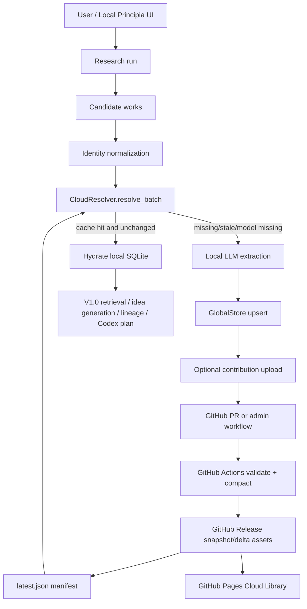

# Principia V1.1 Design Proposal

**Feature name:** Principia Cloud Library  
**Target release:** V1.1  
**Prepared for:** Codex implementation planning  
**Repository target:** `https://github.com/pzqpzq/Principia`  
**Infrastructure constraint:** free, no separately deployed server, preferably hosted directly through the Principia GitHub repository  
**Design status:** proposal, not final implementation plan

---

## 0. Codex handoff summary

This document is intended to be handed to Codex after it has access to the current local repository and data. Codex should use it to produce a concrete implementation plan and then implement the changes incrementally.

The core V1.1 decision is:

> Build a GitHub-native, serverless, static cloud-memory distribution layer. Do not build a traditional hosted database. Do not put tens of millions of raw JSON files into the Git tree. Store small manifests and code in the repository, and store large compressed immutable data packs as GitHub Release assets. The local Principia client should cache route indexes and hydrate records into local SQLite.

The resulting product is:

> **Principia Cloud Library:** a GitHub-hosted, versioned, compressed, deduplicated, contribution-aware research-memory layer for Principia Local.

This design extends V1.0 rather than replacing it. V1.0 already has a local normalized research memory with work identity, work versions, extraction runs, concept cards, concept versions, evidence links, concept-level retrieval, project membership, and symbolic lineage. V1.1 should add a cloud snapshot layer above that local memory.

---

## 1. Context from V1.0

### 1.1 Current product thesis

Principia is a principle-first idea discovery system. Its core claim is that research ideation should not be a black-box chat interaction. It should convert literature and user feedback into reusable principles, generate ideas through explicit principle operators, expose idea lineage, estimate validation outcomes, and export step-by-step Codex validation prompts.

V1.1 must preserve these V1.0 product commitments:

- ideas must remain traceable to source works, principles, assumptions, failure modes, and evidence;
- extracted records must be typed objects, not loose summaries;
- LLM failures must be surfaced, not silently replaced with template-like content;
- private papers, private code, and unpublished ideas must not be uploaded by default;
- benchmarks and baselines should be official/source-grounded;
- speculative symbolic nodes should remain labeled as low-confidence/L0 rather than mixed into evidence-backed literature facts.

### 1.2 Current V1.0 code inventory

The uploaded V1.0 package contains a local-first Python application with these relevant files:

```text
principia.py                         # CLI entrypoint
principia/server.py                  # local web server and API routes
principia/engine.py                  # research, extraction, retrieval, generation logic
principia/global_store.py            # normalized V1 research memory services
principia/schema.py                  # SQLite schema and artifact directories
principia/identity_resolver.py       # work identity resolution
principia/work_versioning.py         # title/content hashes and version decisions
principia/research_sources.py        # OpenAlex/Crossref style source retrieval
principia/arxiv.py                   # arXiv source retrieval
principia/llm_client.py              # LLM calls
principia/storage.py                 # legacy-compatible storage surface
principia/concept_indexer.py         # concept/work indexing
principia/concept_canonicalizer.py   # concept canonicalization
principia/symbolic_ideator.py        # Principia Calculus / lineage mode
static/                              # local browser UI
static/index.html
static/app.js
static/idea.html
static/idea.js
static/explore.html
static/explore.js
tests/test_principia_v1.py           # large regression suite
data/principia.sqlite                # included local demo/release database
```

V1.0 already defines these normalized local tables:

```text
global_work
work_version
extraction_run
concept_card
concept_version
evidence_link
symbol_registry
derivation_run
derivation_node
derivation_edge
project_record_membership
run_event
embedding_index
migration_status
```

Observed in the uploaded local SQLite package at proposal time:

```text
records:                    3335
global_work:                 396
work_version:                404
concept_card:                390
concept_version:            1139
evidence_link:              1162
symbol_registry:              42
derivation_run:                3
derivation_node:              67
derivation_edge:              31
project_record_membership:  1164
run_event:                     4
embedding_index:               0
```

Current concept-card type counts in the uploaded local database:

```text
benchmark:        186
result_fact:      124
principle:         31
takeaway_message:  15
derived_concept:   14
baseline:           8
existed_idea:       8
generated_idea:     4
```

Codex should treat these counts as a local demo snapshot, not production assumptions.

### 1.3 What V1.1 must add

V1.1 must add:

1. a free/no-server GitHub-hosted cloud library;
2. efficient storage for tens of millions of work records and associated extracted objects;
3. concept deduplication across works, especially for benchmarks, baselines, principles, takeaways, and existed ideas;
4. per-paper, per-LLM extraction versioning with maximum `3K` retained versions per paper if `K` LLM configurations exist;
5. research-time cloud lookup to skip unnecessary LLM extraction;
6. a cloud database viewer/search UI;
7. an admin auto-crawler for AI venues;
8. admin edit/add/delete/merge management operations;
9. GitHub-native upload/contribution workflows.

---

## 2. External platform constraints

The no-server/free/GitHub-only constraint changes the architecture. GitHub should be used as static distribution and workflow infrastructure, not as a row-level transactional database.

### 2.1 Git repository constraints

GitHub blocks files larger than 100 MiB and recommends repositories stay small, ideally under 1 GiB and strongly under 5 GiB. Therefore, V1.1 must not commit multi-gigabyte snapshots, large SQLite files, or millions of per-paper JSON files into the normal Git tree.

### 2.2 GitHub Releases as object distribution

GitHub Release assets are a better fit for large static data. Each release can have up to 1000 assets, each asset must be under 2 GiB, and the release docs state no total release-size or bandwidth limit. V1.1 should store compressed snapshots and deltas as Release assets.

### 2.3 GitHub Pages as static UI

GitHub Pages can host a static website directly from a public repository under GitHub Free. It should be used for a static Cloud Library browser and documentation. It must not be treated as a dynamic backend.

### 2.4 GitHub Actions as free serverless workflows

Standard GitHub-hosted Actions runners are free for public repositories. They can validate contribution packs, compact deltas, generate release assets, and run scheduled or manually triggered crawler jobs. Scheduled workflows can be delayed or dropped under GitHub load, so scheduled crawling should be best-effort, not time-critical.

### 2.5 GitHub REST API limits

GitHub REST API is rate-limited: unauthenticated requests are low-volume, and authenticated requests are also limited. V1.1 must not perform one GitHub API request per paper lookup. It should fetch static assets and perform lookups locally.

### 2.6 Git LFS caution

Git LFS has metered storage/bandwidth behavior and is not the best free distribution mechanism for a public tens-of-millions record library. Prefer GitHub Releases over Git LFS for cloud data packs.

---

## 3. Product definition

### 3.1 V1.1 product name

Use one of these names in UI:

```text
Principia Cloud Library
Principia Cloud Memory
Principia Public Principle Pool
```

Recommended: **Principia Cloud Library**.

### 3.2 Product role

Principia V1.1 should behave as:

```text
Local user goal
  -> local candidate-paper discovery
  -> cloud lookup
  -> reuse existing extracted cloud memory when safe
  -> run LLM extraction only for missing/stale records
  -> hydrate local SQLite
  -> continue V1.0 principle retrieval, idea generation, lineage, and Codex export
```

### 3.3 Product boundary

V1.1 is **not**:

- a hosted Postgres database;
- a hosted vector database;
- a server process deployed by the project owner;
- a full-text paper/PDF archive;
- a guarantee that every cold-start lookup will finish in 1-2 seconds;
- a public upload endpoint protected only by a hardcoded shared key.

V1.1 **is**:

- a serverless static data-distribution layer;
- a local cache and resolver;
- a release-asset snapshot system;
- a contribution and validation workflow mediated by GitHub;
- a cloud viewer backed by manifests, facet indexes, and downloadable record packs.

---

## 4. High-level architecture

### 4.1 Architecture diagram



### 4.2 Repository responsibilities

```text
main branch:
  code
  schemas
  small manifests/pointers
  docs
  GitHub Actions workflows
  static Cloud Library UI

GitHub Releases:
  compressed immutable snapshot assets
  delta packs
  route-index shards
  facet-index shards
  semantic-index shards when enabled

GitHub Pages:
  static cloud dashboard
  static cloud search UI
  documentation and stats

Local machine:
  actual query execution
  local SQLite hydration
  LLM extraction
  admin token handling
  local cache
```

### 4.3 Proposed repository layout

```text
Principia/
  principia/
    cloud/
      __init__.py
      models.py
      ids.py
      manifest.py
      compression.py
      pack.py
      route_index.py
      cache.py
      resolver.py
      hydrate.py
      contribution.py
      github_client.py
      validator.py
      compactor.py
      search.py
      admin_ops.py
      crawler.py
      sources/
        __init__.py
        openalex.py
        semantic_scholar.py
        arxiv_source.py
        openreview_source.py
        crossref_source.py
      priority.py

  cloud/
    schema/
      cloud_manifest.schema.json
      cloud_work_record.schema.json
      cloud_concept_record.schema.json
      cloud_relation_record.schema.json
      cloud_contribution.schema.json
      cloud_admin_operation.schema.json
    manifests/
      latest.json              # tiny pointer to latest release manifest
    examples/
      contribution.example.json
      admin_operation.example.json

  static/
    cloud.html
    cloud.js
    cloud.css

  .github/
    workflows/
      principia-cloud-validate.yml
      principia-cloud-compact.yml
      principia-cloud-release.yml
      principia-cloud-crawl.yml

  tests/
    test_cloud_manifest.py
    test_cloud_pack.py
    test_cloud_route_index.py
    test_cloud_resolver.py
    test_cloud_contribution.py
    test_cloud_retention.py
    test_cloud_admin_ops.py
    test_cloud_crawler.py
```

---

## 5. Core design decision: GitHub static cloud library, not Git-tracked database

### 5.1 Rejected design: JSON files in Git

Do not store records like this:

```text
cloud/works/W_000000001.json
cloud/works/W_000000002.json
...
cloud/works/W_10000000.json
```

Reasons:

- too many files for Git operations;
- repository clone becomes slow or unusable;
- GitHub repository size guidance is violated quickly;
- file-by-file lookup through raw GitHub or REST API will be rate-limited and slow;
- updating records creates huge Git history churn.

### 5.2 Rejected design: one giant SQLite file in Git

Do not commit a single giant `cloud.sqlite` to `main`.

Reasons:

- SQLite snapshots can exceed normal GitHub file limits;
- every update rewrites the binary file and bloats history;
- normal Git diffs are useless;
- users cloning code would be forced to clone data.

### 5.3 Accepted design: manifests + route indexes + compressed packs

Use a three-layer layout:

```text
1. tiny manifest pointer in Git
2. compressed route/facet/search index assets in GitHub Releases
3. compressed record-pack assets in GitHub Releases
```

Local clients download only the manifest, the index shards they need, and the data-pack byte ranges or blocks they need.

---

## 6. Cloud data model

V1.1 should mirror and extend the existing V1.0 local schema.

### 6.1 ID rules

Use stable content/identity IDs:

```text
W_...      work identity
WV_...     work source version
XRUN_...   extraction run / extraction version
C_...      generic concept
P_...      principle concept
B_...      benchmark concept
BL_...     baseline concept
TM_...     takeaway-message concept
EI_...     existed-idea concept
RF_...     result-fact concept
EV_...     evidence link
REL_...    relation edge
OP_...     admin operation
DELTA_...  delta pack
SNAP_...   snapshot
```

Prefer SHA-256-derived IDs truncated to a safe length, using canonical normalized content. Keep IDs stable across machines.

### 6.2 Model key

Versioning must be per LLM configuration, not just per model name. Define:

```text
model_key = provider + ":" + model + ":" + model_mode + ":" + prompt_version + ":" + schema_version + ":" + extraction_task_type
```

Example:

```text
openai:gpt-5.5-pro:auto:principia-work-extract-v1:principia-cloud-1.1:work_concepts
siliconflow:Qwen/Qwen3-235B-A22B-Instruct-2507:slow:principia-work-extract-v1:principia-cloud-1.1:work_concepts
human-curated:manual:curated:manual-edit-v1:principia-cloud-1.1:curated_overlay
```

### 6.3 Work identity record

```json
{
  "record_type": "work",
  "work_id": "W_sha256_...",
  "identity": {
    "canonical_title": "...",
    "title_norm": "...",
    "title_hash": "...",
    "doi": "...",
    "arxiv_id": "...",
    "openalex_id": "...",
    "crossref_id": "...",
    "semantic_scholar_id": "...",
    "openreview_forum_id": "...",
    "authors": ["..."],
    "year": 2026,
    "venue_or_source": "ICLR",
    "source_type": "paper",
    "source_urls": ["..."]
  },
  "source_state": {
    "source_provider": "openalex|arxiv|openreview|semantic_scholar|crossref|manual",
    "source_record_id": "...",
    "source_modified_at": "2026-05-10T00:00:00Z",
    "source_updated_at": "2026-05-12T00:00:00Z",
    "title_hash": "...",
    "abstract_hash": "...",
    "content_hash": "...",
    "metadata_hash": "..."
  },
  "latest_by_model": {
    "openai:gpt-5.5-pro:auto:principia-work-extract-v1:principia-cloud-1.1:work_concepts": {
      "active_extraction_run_id": "XRUN_...",
      "active_work_version_id": "WV_...",
      "last_three_extraction_run_ids": ["XRUN_c", "XRUN_b", "XRUN_a"],
      "last_three_record_pack_refs": ["..."]
    }
  },
  "relations": {
    "principles": ["P_..."],
    "benchmarks": ["B_..."],
    "baselines": ["BL_..."],
    "takeaway_messages": ["TM_..."],
    "existed_ideas": ["EI_..."],
    "result_facts": ["RF_..."],
    "evidence_links": ["EV_..."]
  },
  "quality": {
    "validation_level": "L1",
    "identity_confidence": 1.0,
    "verification_status": "llm_extracted|human_reviewed|needs_review|tombstoned",
    "public_scope": "public_cloud"
  },
  "timestamps": {
    "created_at": "...",
    "updated_at": "..."
  }
}
```

### 6.4 Work version record

```json
{
  "record_type": "work_version",
  "work_version_id": "WV_...",
  "work_id": "W_...",
  "title": "...",
  "abstract": "...",
  "title_hash": "...",
  "abstract_hash": "...",
  "content_hash": "...",
  "source_provider": "arxiv",
  "source_record_id": "2401.00000",
  "source_modified_at": "...",
  "source_updated_at": "...",
  "metadata": {
    "authors": ["..."],
    "venue": "...",
    "year": 2026,
    "citation_count": 0,
    "license": "...",
    "official_pdf_url": "..."
  },
  "created_at": "..."
}
```

### 6.5 Extraction version record

```json
{
  "record_type": "extraction_run",
  "extraction_run_id": "XRUN_...",
  "work_id": "W_...",
  "work_version_id": "WV_...",
  "model_key": "openai:gpt-5.5-pro:auto:principia-work-extract-v1:principia-cloud-1.1:work_concepts",
  "llm_provider": "openai",
  "llm_model": "gpt-5.5-pro",
  "model_mode": "auto",
  "prompt_version": "principia-work-extract-v1",
  "schema_version": "principia-cloud-1.1",
  "extraction_task_type": "work_concepts",
  "extraction_status": "completed",
  "token_estimates": {
    "input": 0,
    "output": 0
  },
  "cost_estimate": 0.0,
  "result_summary": {
    "principle_count": 3,
    "benchmark_count": 2,
    "baseline_count": 1,
    "takeaway_count": 4
  },
  "result_refs": {
    "concept_ids": ["P_...", "B_..."],
    "relation_ids": ["REL_..."],
    "evidence_ids": ["EV_..."]
  },
  "created_at": "...",
  "completed_at": "..."
}
```

### 6.6 Concept record

The same benchmark/baseline/principle/takeaway should be stored once and referenced by many works when the canonicalization confidence is high enough.

```json
{
  "record_type": "concept",
  "concept_id": "B_...",
  "concept_type": "benchmark",
  "canonical_key": "benchmark:helm",
  "canonical_label": "HELM",
  "aliases": ["Holistic Evaluation of Language Models"],
  "payload": {
    "definition": "...",
    "task_family": "...",
    "metrics": ["..."],
    "official_url": "...",
    "notes": "..."
  },
  "support": {
    "supporting_work_ids": ["W_..."],
    "evidence_count": 17,
    "confidence_score": 0.91,
    "validation_level": "L4",
    "verification_status": "human_reviewed"
  },
  "versioning": {
    "active_version_id": "CV_...",
    "last_three_version_ids_by_model": {
      "openai:gpt-5.5-pro:auto:principia-concept-v1:principia-cloud-1.1:concept_canonicalization": ["CV_3", "CV_2", "CV_1"]
    }
  },
  "timestamps": {
    "created_at": "...",
    "updated_at": "..."
  }
}
```

### 6.7 Concept deduplication policy

Use a conservative deduplication pipeline:

```text
1. Exact canonical key match
2. Alias dictionary match
3. External identifier match where available
4. Normalized label + type + metric/task similarity
5. Embedding similarity only as a candidate generator
6. Human/admin review for ambiguous merges
```

Never aggressively merge two concepts just because they have similar embeddings. For benchmarks and baselines, false merges are highly damaging.

Deduplication confidence levels:

```text
D0 no match
D1 lexical candidate only, do not merge
D2 likely match, require review
D3 strong match, merge automatically but mark reviewable
D4 verified canonical concept
D5 admin/human curated canonical concept
```

### 6.8 Relation record

```json
{
  "record_type": "relation",
  "relation_id": "REL_...",
  "subject_id": "W_...",
  "predicate": "WORK_HAS_BENCHMARK",
  "object_id": "B_...",
  "evidence_ids": ["EV_..."],
  "confidence": 0.88,
  "source": "llm_extraction|human_curated|crawler_metadata",
  "model_key": "...",
  "created_at": "..."
}
```

Recommended predicates:

```text
WORK_HAS_PRINCIPLE
WORK_HAS_BENCHMARK
WORK_HAS_BASELINE
WORK_HAS_TAKEAWAY
WORK_HAS_EXISTED_IDEA
WORK_HAS_RESULT_FACT
WORK_SUPPORTS_CONCEPT
WORK_CONTRADICTS_CONCEPT
CONCEPT_ALIASES_CONCEPT
CONCEPT_REPLACES_CONCEPT
CONCEPT_RELATED_TO_CONCEPT
CONCEPT_DEPENDS_ON_CONCEPT
CONCEPT_FAILS_WHEN
CONCEPT_RESOLVES_TRADEOFF
```

### 6.9 Evidence record

```json
{
  "record_type": "evidence",
  "evidence_id": "EV_...",
  "concept_id": "P_...",
  "work_id": "W_...",
  "work_version_id": "WV_...",
  "evidence_type": "abstract|metadata|section_summary|table_fact|manual_note",
  "locator": {
    "section": "Abstract",
    "paragraph_index": 0,
    "source_url": "..."
  },
  "snippet": "bounded short evidence text, not full paper text",
  "claim_text": "...",
  "confidence": 0.82,
  "created_at": "..."
}
```

Do not store full paper text in the public cloud snapshot. Store metadata, abstract where licensing allows, short bounded evidence snippets, source URLs, and extracted structured records.

---

## 7. Version retention rules

### 7.1 Required rule

For each `(work_id, model_key)`, retain at most three extraction versions:

```text
active latest version + two previous backups
```

If there are `K` supported LLM configurations, each work has at most:

```text
3K extraction versions
```

### 7.2 Retention pseudo-code

```python
def append_extraction_version(work_id: str, model_key: str, new_run_id: str) -> list[str]:
    old = latest_by_model.get((work_id, model_key), [])
    updated = [new_run_id] + [run_id for run_id in old if run_id != new_run_id]
    return updated[:3]
```

### 7.3 Compaction behavior

During compaction:

1. keep active and backup extraction records for each `(work_id, model_key)`;
2. mark pruned versions as inactive in old release metadata if necessary;
3. do not expose pruned versions in the active manifest;
4. optionally archive old versions in a separate archival release that the default client ignores.

### 7.4 Human curated versions

Manual admin edits should not silently overwrite LLM extraction history. Store them as either:

```text
model_key = human-curated:manual:curated:manual-edit-v1:principia-cloud-1.1:curated_overlay
```

or as an explicit `curated_overlay` operation layered over the latest LLM extraction.

---

## 8. Storage and distribution format

### 8.1 Release asset structure

A typical release should look like:

```text
Release: principia-cloud-snapshot-2026-06-xx

assets/
  manifest.json
  stats.json
  work-route-index-meta.json
  work-route-index-00.sqlite.zst
  work-route-index-01.sqlite.zst
  ...
  concept-route-index-meta.json
  concept-route-index-00.sqlite.zst
  facet-index.sqlite.zst
  lexical-title-index.zst
  semantic-centroids.f16.zst                # optional in V1.1.1+
  semantic-vector-shard-0000.f16.zst        # optional in V1.1.1+
  pack-work-0000.pcz
  pack-work-0001.pcz
  pack-concept-0000.pcz
  pack-relation-0000.pcz
  pack-evidence-0000.pcz
  delta-2026-06-xx-001.pcz
  tombstones-2026-06-xx.json.zst
  checksums.sha256
```

### 8.2 Asset size targets

Hard requirement:

```text
each release asset < 2 GiB
```

Recommended operational targets:

```text
small index shard: 10-100 MiB compressed
large route index shard: 100-512 MiB compressed
record pack: 128-512 MiB compressed
maximum assets per full release: < 900 to leave headroom under the 1000 asset limit
```

### 8.3 Pack container

Use a simple deterministic pack format, not a complex new database engine.

Suggested file extension:

```text
.pcz = Principia compressed zstd pack
```

Logical structure:

```text
PCZ_MAGIC
format_version
pack_id
snapshot_id
record_type
compression = zstd
block_size
block_index_offset
block_index_length
records...
block_index...
footer_checksum
```

Simpler MVP alternative:

```text
newline-delimited JSON records grouped into zstd-compressed blocks
external SQLite route index points to block_id, offset, length, checksum
```

### 8.4 Route index

Route index maps IDs to pack locations.

```sql
CREATE TABLE cloud_work_route (
    work_id TEXT PRIMARY KEY,
    title_hash TEXT,
    doi TEXT,
    arxiv_id TEXT,
    openalex_id TEXT,
    crossref_id TEXT,
    semantic_scholar_id TEXT,
    pack_id TEXT NOT NULL,
    offset INTEGER NOT NULL,
    length INTEGER NOT NULL,
    block_id TEXT,
    checksum TEXT NOT NULL,
    source_modified_at TEXT,
    source_updated_at TEXT,
    abstract_hash TEXT,
    content_hash TEXT,
    latest_by_model_json TEXT NOT NULL
);

CREATE INDEX idx_cloud_work_route_doi ON cloud_work_route(doi) WHERE doi IS NOT NULL AND doi != '';
CREATE INDEX idx_cloud_work_route_arxiv ON cloud_work_route(arxiv_id) WHERE arxiv_id IS NOT NULL AND arxiv_id != '';
CREATE INDEX idx_cloud_work_route_openalex ON cloud_work_route(openalex_id) WHERE openalex_id IS NOT NULL AND openalex_id != '';
CREATE INDEX idx_cloud_work_route_title_hash ON cloud_work_route(title_hash);
```

Concept route index:

```sql
CREATE TABLE cloud_concept_route (
    concept_id TEXT PRIMARY KEY,
    concept_type TEXT NOT NULL,
    canonical_key TEXT NOT NULL,
    canonical_label TEXT,
    alias_hashes_json TEXT,
    pack_id TEXT NOT NULL,
    offset INTEGER NOT NULL,
    length INTEGER NOT NULL,
    block_id TEXT,
    checksum TEXT NOT NULL,
    active_version_id TEXT,
    support_count INTEGER DEFAULT 0,
    confidence_score REAL DEFAULT 0.5
);

CREATE INDEX idx_cloud_concept_type_key ON cloud_concept_route(concept_type, canonical_key);
CREATE INDEX idx_cloud_concept_label ON cloud_concept_route(canonical_label);
```

### 8.5 Route index sharding

For tens of millions of works, one route index may become too large. Use shard routing:

```text
work-route-index-meta.json:
  shard_count: 256 or 1024
  shard_key: first bytes of sha256(work_id or external id canonical key)
  shards:
    00: work-route-index-00.sqlite.zst
    01: work-route-index-01.sqlite.zst
    ...
```

The local resolver computes which route shards are needed for the current candidate batch and downloads only those shards.

### 8.6 Facet index

A separate facet index supports UI search without listing millions of works:

```sql
CREATE TABLE facet_counts (
    facet_type TEXT,
    facet_value TEXT,
    count INTEGER,
    PRIMARY KEY (facet_type, facet_value)
);

CREATE TABLE facet_work_refs (
    facet_type TEXT,
    facet_value TEXT,
    work_id TEXT
);

CREATE INDEX idx_facet_work_refs ON facet_work_refs(facet_type, facet_value);
```

Facets:

```text
venue_or_source
year
source_type
concept_type
benchmark_id
baseline_id
validation_level
llm_model_coverage
topic/category
citation_bucket
oral_spotlight_award_signal
```

### 8.7 Lexical search index

MVP lexical search can be implemented as:

1. compressed title index with normalized tokens;
2. facet filtering;
3. local SQLite FTS after downloading a small search shard.

Avoid trying to load every title into browser memory for tens of millions of works.

### 8.8 Semantic search index

Semantic search is desirable but not required for the first V1.1 milestone.

Recommended V1.1.1 approach:

```text
query embedding generated locally or by user's configured embedding API
  -> nearest centroid lookup from small centroid file
  -> download only matching vector shard(s)
  -> local ANN or brute-force over shard
  -> topK work/concept IDs
  -> resolve records through route index
```

Do not deploy a hosted vector database under the free/no-server constraint.

### 8.9 Delta strategy

Use full snapshots plus deltas.

```text
full snapshot: monthly or manually triggered
small delta: daily/weekly/admin-triggered
local client: base snapshot + ordered deltas + tombstones
```

Manifest must specify:

```json
{
  "snapshot_id": "SNAP_2026_06_13_001",
  "base_snapshot_id": null,
  "created_at": "2026-06-13T00:00:00Z",
  "schema_version": "principia-cloud-1.1",
  "assets": [...],
  "deltas": [...],
  "tombstones": [...],
  "checksums": {...}
}
```

---

## 9. Manifest format

### 9.1 Tiny latest pointer in Git

`cloud/manifests/latest.json` should remain small:

```json
{
  "schema_version": "principia-cloud-pointer-1.1",
  "latest_snapshot_id": "SNAP_2026_06_13_001",
  "latest_manifest_url": "https://github.com/pzqpzq/Principia/releases/download/principia-cloud-snapshot-2026-06-13/manifest.json",
  "latest_manifest_sha256": "...",
  "updated_at": "2026-06-13T00:00:00Z"
}
```

### 9.2 Full manifest

```json
{
  "schema_version": "principia-cloud-1.1",
  "snapshot_id": "SNAP_2026_06_13_001",
  "created_at": "2026-06-13T00:00:00Z",
  "generated_by": {
    "tool": "principia.cloud.compactor",
    "tool_version": "1.1.0",
    "git_commit": "..."
  },
  "counts": {
    "works": 10000000,
    "work_versions": 10200000,
    "active_extraction_versions": 25000000,
    "concepts": 3000000,
    "relations": 80000000,
    "evidence_links": 70000000
  },
  "supported_model_keys": [
    "openai:gpt-5.5-pro:auto:principia-work-extract-v1:principia-cloud-1.1:work_concepts"
  ],
  "retention_policy": {
    "max_versions_per_work_model_key": 3
  },
  "route_indexes": {
    "work": {
      "meta_asset": "work-route-index-meta.json",
      "shard_count": 256,
      "shard_key": "sha256_identity_prefix"
    },
    "concept": {
      "meta_asset": "concept-route-index-meta.json",
      "shard_count": 64,
      "shard_key": "sha256_concept_id_prefix"
    }
  },
  "assets": [
    {
      "asset_id": "pack-work-0000",
      "kind": "pack",
      "record_type": "work",
      "url": "...",
      "bytes": 123456789,
      "sha256": "...",
      "compression": "zstd",
      "format": "pcz"
    }
  ],
  "deltas": [],
  "tombstones": [],
  "license_notice": "metadata and extracted research-memory records; no full paper text",
  "source_attribution_policy": "records must preserve DOI/arXiv/OpenAlex/OpenReview/Semantic Scholar/Crossref/source URLs when available"
}
```

---

## 10. Local cache design

Add local SQLite tables. These can live in the existing `data/principia.sqlite` or in a separate `data/cloud_cache.sqlite`. Recommended: start with existing local DB for simplicity, but keep table names prefixed with `cloud_`.

```sql
CREATE TABLE IF NOT EXISTS cloud_manifest_cache (
    snapshot_id TEXT PRIMARY KEY,
    manifest_json TEXT NOT NULL,
    manifest_url TEXT,
    manifest_sha256 TEXT,
    fetched_at TEXT NOT NULL,
    active INTEGER DEFAULT 1
);

CREATE TABLE IF NOT EXISTS cloud_asset_cache (
    asset_id TEXT PRIMARY KEY,
    snapshot_id TEXT NOT NULL,
    kind TEXT NOT NULL,
    record_type TEXT,
    url TEXT NOT NULL,
    local_path TEXT,
    sha256 TEXT,
    bytes INTEGER,
    fetched_at TEXT,
    cache_status TEXT DEFAULT 'missing'
);

CREATE TABLE IF NOT EXISTS cloud_route_shard_cache (
    shard_id TEXT PRIMARY KEY,
    snapshot_id TEXT NOT NULL,
    route_type TEXT NOT NULL,
    local_path TEXT NOT NULL,
    sha256 TEXT NOT NULL,
    fetched_at TEXT NOT NULL
);

CREATE TABLE IF NOT EXISTS cloud_resolution_cache (
    cache_key TEXT PRIMARY KEY,
    snapshot_id TEXT NOT NULL,
    work_id TEXT,
    resolution_json TEXT NOT NULL,
    model_key TEXT,
    source_state_hash TEXT,
    decision TEXT,
    created_at TEXT NOT NULL
);

CREATE TABLE IF NOT EXISTS cloud_payload_cache (
    record_id TEXT PRIMARY KEY,
    snapshot_id TEXT NOT NULL,
    record_type TEXT NOT NULL,
    payload_json TEXT NOT NULL,
    payload_sha256 TEXT NOT NULL,
    fetched_at TEXT NOT NULL
);

CREATE TABLE IF NOT EXISTS cloud_upload_log (
    upload_id TEXT PRIMARY KEY,
    work_id TEXT,
    model_key TEXT,
    contribution_path TEXT,
    github_pr_url TEXT,
    upload_mode TEXT,
    status TEXT,
    created_at TEXT NOT NULL,
    completed_at TEXT
);
```

Add indexes for lookup by `work_id`, `model_key`, `snapshot_id`, and `decision`.

---

## 11. Research-time cloud lookup

### 11.1 Required behavior

When the user sets target work count `N`, Principia should:

```text
1. crawl/retrieve N candidate works;
2. normalize each candidate's identity;
3. batch-resolve candidates against cloud route indexes;
4. for each candidate decide whether to reuse cloud memory or run local LLM extraction;
5. hydrate reusable cloud records into local SQLite;
6. only call the selected LLM for records that are missing, stale, or missing the current model_key;
7. continue the existing V1.0 research/idea-generation workflow.
```

### 11.2 Decision rules

```python
def should_extract_with_llm(candidate, model_key, cloud_record):
    if cloud_record is None:
        return True, "not_in_cloud"

    latest_by_model = cloud_record.get("latest_by_model") or {}
    if model_key not in latest_by_model:
        return True, "model_version_missing"

    candidate_modified = candidate.get("source_modified_at") or candidate.get("source_updated_at") or ""
    cloud_modified = cloud_record.get("source_state", {}).get("source_modified_at") or cloud_record.get("source_state", {}).get("source_updated_at") or ""

    if candidate_modified and cloud_modified and candidate_modified > cloud_modified:
        return True, "source_newer_than_cloud"

    candidate_abstract_hash = hash_abstract(candidate.get("abstract", ""))
    cloud_abstract_hash = cloud_record.get("source_state", {}).get("abstract_hash")
    if candidate_abstract_hash and cloud_abstract_hash and candidate_abstract_hash != cloud_abstract_hash:
        return True, "abstract_hash_changed"

    candidate_content_hash = work_content_signature(candidate).get("content_hash")
    cloud_content_hash = cloud_record.get("source_state", {}).get("content_hash")
    if candidate_content_hash and cloud_content_hash and candidate_content_hash != cloud_content_hash:
        return True, "content_hash_changed"

    return False, "cloud_cache_hit"
```

### 11.3 Hydration into V1.0 local tables

Cloud records should be inserted or updated into existing V1.0 tables:

```text
cloud work record       -> global_work
cloud work version      -> work_version
cloud extraction record -> extraction_run
cloud concept record    -> concept_card + concept_version
cloud evidence record   -> evidence_link
cloud relation record   -> existing graph/lineage-compatible relation tables or new cloud_relation table
```

Hydration must preserve:

```text
cloud_snapshot_id
cloud_record_id
cloud_model_key
cloud_payload_sha256
cloud_updated_at
```

Codex should add these as metadata JSON fields if changing the schema is risky for the first phase.

### 11.4 Batch and concurrency requirements

Implement `CloudResolver.resolve_batch(candidates, model_key)`.

Expected behavior:

```text
Input: list of candidate work dicts and current model_key
Output: list of resolution decisions and hydrated payload references
```

The resolver must:

- compute identity keys for all candidates first;
- determine which route shards are needed;
- fetch missing route shards concurrently;
- reuse local cached route shards where checksum matches;
- batch SQL queries against local route shards;
- coalesce pack fetches by asset and byte range or block;
- fall back to whole-block or whole-pack download if HTTP Range is unavailable;
- store fetched payloads in `cloud_payload_cache`.

### 11.5 Performance target

Because GitHub static hosting is not a provisioned database, avoid promising a hard SLA for cold cache. Define targets honestly:

```text
Warm cache, typical research batch: 1-2 seconds for cloud resolution and local hydration.
Cold cache: may exceed 1-2 seconds because route index shards or packs must be downloaded.
100 simultaneous users: should work without a shared server bottleneck because each user reads static GitHub/CDN assets and performs local lookup, but GitHub/CDN conditions are outside Principia's control.
```

Engineering tactics:

- never call GitHub REST API once per paper;
- use static asset URLs and local SQLite indexes;
- use ETag/If-None-Match or checksum-based skipping where possible;
- use async HTTP with bounded concurrency;
- use shard-level caching;
- use background prefetch after goal submission;
- fetch only latest active version by default;
- do not fetch the two backup versions unless requested by admin/history UI.

---

## 12. Upload and contribution workflow

### 12.1 No static shared secret in frontend

Do not put a shared upload key in `static/cloud.js` or GitHub Pages. Any key in browser JavaScript is public.

Recommended approach:

```text
Contributor mode:
  local app writes contribution JSON/PCZ pack
  user opens a GitHub PR manually or via GitHub CLI/PAT
  GitHub Actions validates
  maintainer/admin approves

Admin mode:
  local app asks for local admin gate/passphrase and GitHub fine-grained PAT
  PAT is stored only in local .env/keychain/session memory
  local app creates branch/PR or triggers workflow_dispatch
  GitHub Actions validates and compacts
```

If the product still needs a “specific key” UX, implement it as a **local admin gate** only:

```text
PRINCIPIA_ADMIN_UPLOAD_KEY=...
```

This key can unlock local admin UI controls, but GitHub writes must still require a GitHub token or GitHub Actions secret.

### 12.2 Upload success rules

Upload may succeed in three cases:

#### Case A: new work

If the incoming work does not exist in the cloud route index, accept as a new cloud work.

#### Case B: source is newer

If the incoming work exists but the source has been modified since the cloud record, accept a new version.

Use:

```text
source_modified_at
source_updated_at
title_hash
abstract_hash
content_hash
metadata_hash
```

If dates are missing or unreliable, use hash changes.

#### Case C: force upload

Admin-only. Force update active version for the given `model_key`, while retaining the two most recent backups.

### 12.3 Contribution file format

```json
{
  "schema_version": "principia-cloud-contribution-1.1",
  "contribution_id": "CONTRIB_...",
  "created_at": "...",
  "created_by": {
    "github_username": "optional",
    "local_user_label": "optional"
  },
  "upload_mode": "normal|force",
  "model_key": "...",
  "work_records": [...],
  "work_version_records": [...],
  "extraction_records": [...],
  "concept_records": [...],
  "relation_records": [...],
  "evidence_records": [...],
  "admin_operations": [],
  "provenance": {
    "principia_version": "1.1.0",
    "source_db_hash": "optional",
    "llm_provider": "...",
    "llm_model": "...",
    "prompt_version": "..."
  }
}
```

### 12.4 Validation pipeline

GitHub Actions should run:

```text
1. JSON schema validation
2. ID format validation
3. checksum validation
4. source attribution validation
5. no-full-text/public-data policy check
6. duplicate identity check
7. freshness check
8. model_key and retention-policy check
9. concept canonicalization conflict check
10. relation/evidence referential integrity check
11. tombstone conflict check
12. generate validation report artifact
```

PR should not be mergeable until validation passes.

### 12.5 Upload API endpoints

Local API routes:

```text
POST /api/v1/cloud/upload/prepare
POST /api/v1/cloud/upload/submit
GET  /api/v1/cloud/upload/status
```

`prepare` should produce a contribution pack and a validation preview.  
`submit` should either create a PR, commit to an admin branch, or trigger a workflow.

---

## 13. Cloud Library UI

### 13.1 Entry points

Local app:

```text
http://127.0.0.1:8792/cloud
```

GitHub Pages:

```text
https://pzqpzq.github.io/Principia/cloud/
```

### 13.2 Dashboard behavior

The Cloud Library dashboard must not render all works. It should render aggregate stats and then let users search.

Stats:

```text
snapshot ID
snapshot created_at
total works
total active work-model versions
total concept cards
total benchmark concepts
total baseline concepts
total principles
total takeaways
total relation edges
total evidence links
coverage by model_key
coverage by venue
coverage by year
coverage by source provider
newest source_modified_at
last compaction time
pending contribution count
rejected contribution count
tombstoned record count
quality warnings
```

### 13.3 Search modes

```text
Exact lookup:
  DOI
  arXiv ID
  OpenAlex ID
  Crossref ID
  Semantic Scholar ID
  OpenReview forum ID
  title hash

Faceted search:
  venue
  year
  source type
  topic/category
  benchmark
  baseline
  validation level
  model coverage
  citation bucket

Lexical search:
  title
  abstract
  principle label
  benchmark label
  baseline label

Semantic search:
  local query embedding -> centroid/vector shard -> topK -> route index resolution
```

### 13.4 Detail view

For a selected work, show:

```text
title
authors
year
venue/source
DOI/arXiv/OpenAlex/Semantic Scholar/OpenReview links
source_modified_at/source_updated_at
available model_keys
active extraction version per model_key
principles
benchmarks
baselines
takeaway messages
existed ideas
result facts
evidence snippets
relations
version history count
local hydration status
```

Default detail view should only fetch active/latest records. Add an admin/history button for backup versions.

### 13.5 Admin panel

Admin mode should support:

```text
manual add work
edit work metadata
edit concept
merge concepts
split concept
delete/tombstone work
force upload
create crawl plan
run crawl
publish contribution/delta
trigger compaction
view validation report
```

---

## 14. Auto-crawler design

### 14.1 Sources

Implement source adapters:

```text
OpenAlex
Semantic Scholar
arXiv
OpenReview
Crossref
```

Use OpenAlex for broad venue/year/citation discovery, Semantic Scholar for citation/recommendation enrichment, arXiv for preprint/update data, OpenReview for ICLR/NeurIPS-style submission metadata when available, and Crossref as fallback DOI/venue metadata.

### 14.2 Rate-limit-aware adapters

Codex should implement bounded request rates and retries:

```python
class RateLimiter:
    def __init__(self, min_interval_seconds: float, max_concurrency: int = 1): ...
```

Initial defaults:

```text
OpenAlex: use per_page=100, cursor paging for large lists, exponential backoff
Semantic Scholar: default 1 request/second with API key
arXiv: no more than 1 request every 3 seconds, single connection
OpenReview: batch get_all_notes-style retrieval where possible
Crossref: polite user-agent and backoff
```

### 14.3 Venues

Initial venue list:

```text
ICML
NeurIPS
ICLR
CVPR
ICCV
ECCV
ACL
EMNLP
NAACL
TPAMI
JMLR
TMLR
Nature Machine Intelligence
Nature Computational Science
```

Normalize user abbreviations:

```text
NMI -> Nature Machine Intelligence
NCS -> Nature Computational Science
```

### 14.4 Crawler priority score

Admin can select `M`, default `M=100`.

```text
priority_score =
  0.25 * venue_weight
+ 0.20 * recency_weight
+ 0.20 * citation_percentile
+ 0.10 * oral_spotlight_award_signal
+ 0.10 * topic_match_to_Principia_domains
+ 0.10 * benchmark_or_baseline_importance
+ 0.05 * cloud_gap_score
```

`cloud_gap_score` is high when:

```text
work missing from cloud
selected model_key missing
source appears newer than cloud version
work mentions concepts with low support count
work likely contains important benchmark/baseline records
```

### 14.5 Crawler workflow

```text
1. Admin opens Cloud Library -> Auto Crawl.
2. Admin selects venues, years, topics, priority weights, model_key, and M.
3. System builds candidate list with metadata only.
4. System resolves candidates against cloud route indexes.
5. System ranks candidates by priority score.
6. System shows dry-run plan.
7. Admin starts research.
8. Existing V1.0 extraction pipeline researches highest-priority M missing/stale works.
9. Results are saved locally.
10. Admin publishes contribution pack.
11. GitHub Actions validates and compacts into release delta.
```

### 14.6 GitHub Actions crawler mode

Use `workflow_dispatch` for admin-triggered crawl jobs. Scheduled workflows may be useful for small metadata refreshes, but should not be trusted for exact timing.

Workflow inputs:

```yaml
inputs:
  venues:
    description: "Comma-separated venue names"
  years:
    description: "Year range, e.g. 2023-2026"
  max_papers:
    description: "M, default 100"
  model_key:
    description: "Selected extraction model key"
  dry_run:
    description: "true/false"
```

Use repository secrets only for admin-owned API keys. Do not put secrets in static files or committed manifests.

---

## 15. Admin data management

### 15.1 Operations are append-only deltas

Because release snapshots should be immutable, admin edits should be represented as operations and applied during compaction.

### 15.2 Edit operation

```json
{
  "operation_id": "OP_...",
  "operation_type": "edit",
  "target_id": "P_...",
  "target_type": "concept",
  "patch": {
    "canonical_label": "Corrected label",
    "payload.definition": "Corrected definition"
  },
  "reason": "Correct benchmark name and definition",
  "admin_actor": "github_username",
  "created_at": "..."
}
```

### 15.3 Manual add operation

```json
{
  "operation_id": "OP_...",
  "operation_type": "manual_add",
  "target_type": "work|concept|relation|evidence",
  "payload": {...},
  "reason": "Manual addition of important benchmark paper",
  "admin_actor": "github_username",
  "created_at": "..."
}
```

### 15.4 Delete/tombstone operation

```json
{
  "operation_id": "OP_...",
  "operation_type": "delete",
  "target_id": "W_...",
  "target_type": "work",
  "delete_scope": "active_index",
  "reason": "duplicate/corrupted/private data/copyright issue",
  "admin_actor": "github_username",
  "created_at": "..."
}
```

A tombstoned record should disappear from active search/lookup. Physical removal can happen during the next full compaction.

### 15.5 Merge concepts

```json
{
  "operation_id": "OP_...",
  "operation_type": "merge_concepts",
  "from_concept_ids": ["B_old1", "B_old2"],
  "to_concept_id": "B_canonical",
  "alias_policy": "preserve_aliases",
  "relation_rewrite": true,
  "reason": "Duplicate benchmark records",
  "admin_actor": "github_username",
  "created_at": "..."
}
```

### 15.6 Split concept

```json
{
  "operation_id": "OP_...",
  "operation_type": "split_concept",
  "source_concept_id": "B_overbroad",
  "new_concepts": [
    {"concept_id": "B_task_a", "payload": {...}},
    {"concept_id": "B_task_b", "payload": {...}}
  ],
  "relation_rewrite_rules": [...],
  "reason": "Overbroad concept mixed two benchmarks",
  "admin_actor": "github_username",
  "created_at": "..."
}
```

---

## 16. Local API surface

Add stable V1.1 endpoints under `/api/v1/cloud/*`.

```text
GET  /api/v1/cloud/manifest
GET  /api/v1/cloud/stats
POST /api/v1/cloud/resolve
POST /api/v1/cloud/prefetch
POST /api/v1/cloud/hydrate
POST /api/v1/cloud/search
GET  /api/v1/cloud/work/{work_id}
GET  /api/v1/cloud/concept/{concept_id}
POST /api/v1/cloud/upload/prepare
POST /api/v1/cloud/upload/submit
GET  /api/v1/cloud/upload/status
POST /api/v1/cloud/admin/crawl/plan
POST /api/v1/cloud/admin/crawl/run
POST /api/v1/cloud/admin/edit
POST /api/v1/cloud/admin/delete
POST /api/v1/cloud/admin/merge-concepts
POST /api/v1/cloud/admin/split-concept
```

### 16.1 CLI surface

Add commands:

```text
python3 principia.py cloud stats
python3 principia.py cloud manifest --refresh
python3 principia.py cloud resolve --input candidates.json --model-key ...
python3 principia.py cloud prefetch --query "agent memory" --limit 100
python3 principia.py cloud export-snapshot --db data/principia.sqlite --out dist/cloud
python3 principia.py cloud validate-contribution path/to/contribution.json
python3 principia.py cloud upload path/to/contribution.json --mode normal
python3 principia.py cloud crawl --venues ICLR,NeurIPS --years 2024-2026 --max-papers 100 --model-key ...
python3 principia.py cloud compact --input contributions/ --out dist/cloud
```

---

## 17. Integration points with existing code

### 17.1 `schema.py`

Add cloud cache tables and artifact directories:

```python
def ensure_cloud_schema(conn: sqlite3.Connection) -> None:
    ...

def ensure_artifact_dirs(root: Path) -> None:
    # extend existing dirs
    for name in (
        "cloud/manifests",
        "cloud/indexes",
        "cloud/packs",
        "cloud/contributions",
        "cloud/releases",
        "cloud/tmp",
    ):
        ...
```

### 17.2 `global_store.py`

Add methods:

```python
hydrate_cloud_work(record: dict) -> dict
hydrate_cloud_concept(record: dict) -> dict
hydrate_cloud_relation(record: dict) -> dict
hydrate_cloud_evidence(record: dict) -> dict
mark_cloud_origin(local_id: str, snapshot_id: str, payload_hash: str) -> None
```

Keep existing V1.0 behavior stable.

### 17.3 `identity_resolver.py`

Reuse current identity logic but add cloud-batch helpers:

```python
def candidate_identity_keys(work: dict) -> dict[str, str]: ...
def route_shard_keys(identity_keys: dict[str, str], shard_count: int) -> set[str]: ...
```

### 17.4 `work_versioning.py`

Reuse existing `work_content_signature`, `work_version_id`, and `version_decision`. Add:

```python
def model_key(llm_provider, llm_model, model_mode, prompt_version, schema_version, extraction_task_type): ...
def cloud_freshness_decision(candidate, cloud_work, model_key): ...
```

### 17.5 `engine.py`

Insert cloud lookup between candidate retrieval and LLM extraction.

Pseudo-flow:

```python
def run_research(...):
    candidates = retrieve_candidates(...)
    if settings.cloud_lookup_enabled:
        cloud_results = cloud_resolver.resolve_batch(candidates, model_key=current_model_key)
        hydrate_hits(cloud_results.hits)
        candidates_to_extract = [r.candidate for r in cloud_results if r.should_extract]
    else:
        candidates_to_extract = candidates

    run_existing_extraction_pipeline(candidates_to_extract)
```

### 17.6 `server.py`

Add routes under `/api/v1/cloud/*`. Keep existing `/api/v1/*` and `/api/v2/*` routes compatible.

### 17.7 `static/`

Add:

```text
static/cloud.html
static/cloud.js
static/cloud.css
```

Add navigation link from existing UI to Cloud Library.

### 17.8 Tests

Extend `tests/test_principia_v1.py` or add focused files under `tests/test_cloud_*.py`.

---

## 18. Data quality, trust, and moderation

### 18.1 Validation levels

Preserve V1.0 validation levels:

```text
L0: unverified claim or raw LLM extraction
L1: arXiv/preprint or unpublished technical note
L2: peer-reviewed or accepted conference/workshop paper
L3: independently reproduced result or benchmark-supported result
L4: widely used open-source implementation, large community adoption, or deployed system
L5: strong multi-source consensus across papers, benchmarks, deployments, and replications
```

### 18.2 Cloud-specific quality states

```text
raw_llm_extracted
schema_validated
evidence_checked
identity_resolved
concept_deduped
human_reviewed
tombstoned
needs_review
```

### 18.3 Concept canonicalization safeguards

For each canonical concept, keep:

```text
canonical label
aliases
supporting works
evidence count
conflicting aliases
merge history
admin operations
confidence score
validation level
```

If a shared benchmark concept is used by many works, it must be sufficiently complete and reliable. If not, keep separate provisional concepts until reviewed.

### 18.4 Public-data policy

The cloud library should store:

```text
allowed:
  title
  authors
  year
  venue
  DOI/arXiv/OpenAlex/Semantic Scholar/OpenReview IDs
  source URLs
  abstract where allowed
  extracted principles
  extracted benchmarks/baselines/takeaways
  bounded evidence snippets
  metadata
  links and attribution

not allowed by default:
  full paper PDF text
  private user notes
  private code
  unpublished ideas
  private run logs
  API keys
  local .env
  private PDFs
```

---

## 19. Security design

### 19.1 Secrets

Never commit:

```text
.env
API keys
GitHub PATs
admin upload key
LLM provider credentials
private database files unless intentionally released as sanitized demo data
runtime logs containing secrets
```

### 19.2 Token handling

Admin GitHub tokens should be:

```text
fine-grained
repo-scoped
minimal permission
stored locally only
preferably short-lived
never included in GitHub Pages/static JS
never written to contribution packs
```

### 19.3 Upload safety

Before upload:

```text
scan contribution for private paths
scan for API-key-like patterns
check payload length thresholds
reject full-text PDF-like payloads
reject local filesystem paths unless explicitly allowed metadata
require source URLs for public claims where possible
```

### 19.4 Research integrity

Do not let cloud memory encourage low-quality paper generation.

Keep these V1.0 guardrails:

```text
no fabricated citations
no claims without evidence objects
no hiding failed ablations
no result estimates shown as actual results
no auto-submission to conferences
no public sharing of private data by default
```

---

## 20. Implementation phases

### Phase 1: Cloud snapshot MVP

Goal: export and read a small GitHub-style snapshot from current local SQLite.

Build:

```text
principia/cloud/models.py
principia/cloud/manifest.py
principia/cloud/pack.py
principia/cloud/route_index.py
principia/cloud/cache.py
principia/cloud/resolver.py
```

CLI:

```text
python3 principia.py cloud export-snapshot
python3 principia.py cloud manifest
python3 principia.py cloud resolve
```

API:

```text
GET  /api/v1/cloud/manifest
GET  /api/v1/cloud/stats
POST /api/v1/cloud/resolve
```

Acceptance criteria:

```text
- Export current data/principia.sqlite to local dist/cloud snapshot.
- Generated manifest validates against JSON schema.
- Work route index can resolve DOI/arXiv/title_hash/work_id.
- Pack roundtrip preserves records and checksums.
- Local resolver can hydrate at least 10 records back into SQLite.
- Existing V1.0 tests still pass.
```

### Phase 2: Research-time cloud cache

Goal: skip LLM extraction when cloud data is already available and fresh.

Build:

```text
CloudResolver.resolve_batch
CloudHydrator
cloud cache tables
engine integration
UI indicators for cloud hits/misses
```

Acceptance criteria:

```text
- Given candidate works that exist in cloud with same model_key and same content hash, research skips LLM calls.
- Given missing model_key, research runs LLM extraction.
- Given newer source_modified_at or changed abstract hash, research runs LLM extraction.
- Cache-hit/miss counts are shown in run status.
- Completed research still produces normal V1.0 projects, concepts, and idea-generation inputs.
```

### Phase 3: Upload/contribution workflow

Goal: generate and validate contribution packs.

Build:

```text
principia/cloud/contribution.py
principia/cloud/validator.py
principia/cloud/github_client.py
.github/workflows/principia-cloud-validate.yml
```

Acceptance criteria:

```text
- Local extraction can be exported as contribution JSON/PCZ.
- Validator rejects invalid schema, missing work IDs, broken relations, full-text payloads, and retention violations.
- Normal upload accepts new work.
- Normal upload accepts existing work only if source is newer/hash changed.
- Force upload requires admin mode.
- Per work_id/model_key retention keeps max 3 versions.
```

### Phase 4: Cloud Library UI

Goal: local and static cloud viewer.

Build:

```text
static/cloud.html
static/cloud.js
static/cloud.css
GET/POST /api/v1/cloud/search
GET /api/v1/cloud/work/{work_id}
GET /api/v1/cloud/concept/{concept_id}
```

Acceptance criteria:

```text
- Dashboard renders aggregate stats without loading all works.
- Exact lookup by DOI/arXiv/title works.
- Facet search by venue/year/model coverage works.
- Work detail fetches active latest version only by default.
- Admin/history mode can request backup versions.
```

### Phase 5: Admin operations and compaction

Goal: edit/delete/merge/split cloud records via append-only operations.

Build:

```text
principia/cloud/admin_ops.py
principia/cloud/compactor.py
.github/workflows/principia-cloud-compact.yml
.github/workflows/principia-cloud-release.yml
```

Acceptance criteria:

```text
- Edit operation creates curated overlay.
- Delete operation creates tombstone and removes record from active lookup.
- Merge operation rewrites concept relations during compaction.
- Split operation creates new concepts and rewrites selected relations.
- Compaction produces new manifest, route indexes, packs, stats, and checksums.
```

### Phase 6: Auto-crawler

Goal: admin can crawl top AI venues and research top-M missing/stale papers.

Build:

```text
principia/cloud/crawler.py
principia/cloud/sources/openalex.py
principia/cloud/sources/semantic_scholar.py
principia/cloud/sources/arxiv_source.py
principia/cloud/sources/openreview_source.py
principia/cloud/priority.py
.github/workflows/principia-cloud-crawl.yml
```

Acceptance criteria:

```text
- Admin can create dry-run crawl plan for selected venues/years/topics.
- Plan shows candidate count, cloud hits, stale works, missing model versions, and top-M priority list.
- Crawler respects rate limits.
- Selected M works are sent through existing research/extraction pipeline.
- Results can be exported as contribution pack.
```

---

## 21. Testing plan

### 21.1 Unit tests

```text
test_manifest_schema_valid
test_manifest_checksum_validation
test_pack_roundtrip_work_record
test_pack_roundtrip_concept_record
test_route_index_exact_id_resolution
test_route_index_title_hash_resolution
test_route_index_shard_selection
test_cloud_freshness_decision_missing
test_cloud_freshness_decision_model_missing
test_cloud_freshness_decision_unchanged
test_cloud_freshness_decision_source_newer
test_cloud_freshness_decision_hash_changed
test_version_retention_max_three_per_model_key
test_contribution_validator_rejects_full_text
test_contribution_validator_rejects_missing_evidence_target
test_admin_tombstone_removes_from_active_lookup
test_concept_merge_rewrites_relations
test_semantic_search_disabled_gracefully_when_no_embeddings
```

### 21.2 Integration tests

```text
- Export local SQLite -> snapshot -> resolve -> hydrate -> retrieve concepts.
- Research pipeline with artificial cloud hits should make zero LLM calls for hits.
- Research pipeline with stale cloud records should call LLM only for stale records.
- Upload prepare -> validate -> compact -> new manifest -> resolve uploaded work.
- UI endpoint stats/search/detail returns bounded payload sizes.
```

### 21.3 Performance tests

Synthetic tests:

```text
- Generate 100k fake work records and route index.
- Resolve 100 candidate works with warm cache under target time.
- Resolve 1000 candidate works with warm cache under target time.
- Simulate 100 concurrent local resolve calls against cached shards.
- Confirm no per-paper GitHub REST calls occur.
```

### 21.4 Regression tests

All existing V1.0 tests must continue to pass.

---

## 22. Operational workflows

### 22.1 Publishing a snapshot

```text
1. Admin runs local research/crawl or merges validated contributions.
2. Admin runs `principia.py cloud compact`.
3. Tool generates dist/cloud assets and checksums.
4. GitHub Action uploads assets to a new release.
5. GitHub Action updates `cloud/manifests/latest.json`.
6. GitHub Pages dashboard sees latest pointer.
7. Local clients refresh manifest lazily.
```

### 22.2 User research flow with cloud

```text
1. User enters goal and target work count N.
2. Principia retrieves candidate works.
3. Cloud resolver checks selected model_key.
4. Hits are hydrated from cloud.
5. Misses/stale works are extracted locally.
6. User can optionally upload new extractions.
7. Idea generation proceeds as in V1.0.
```

### 22.3 Contributor upload flow

```text
1. User completes local research.
2. User selects "Contribute to Cloud".
3. Local app previews exactly what will be uploaded.
4. User confirms no private data is included.
5. App writes contribution pack.
6. App opens PR or provides GitHub CLI command.
7. GitHub Actions validates.
8. Admin reviews and merges.
9. Next compaction/release publishes the contribution.
```

### 22.4 Admin force-upload flow

```text
1. Admin enables local admin mode.
2. Admin supplies local admin key and GitHub PAT.
3. Admin selects force upload.
4. App creates contribution with upload_mode=force.
5. Validator checks admin authorization marker.
6. Existing active version becomes backup.
7. New extraction becomes active for that model_key.
8. Retention prunes to last three versions.
```

---

## 23. Risks and mitigations

### 23.1 GitHub is not a database

Mitigation:

```text
Use GitHub as static object distribution. Query locally through cached indexes.
```

### 23.2 Cold-start latency

Mitigation:

```text
Small latest pointer, sharded route indexes, background prefetch, delta overlays, and local cache.
```

### 23.3 Millions of records make search hard

Mitigation:

```text
MVP exact/facet/lexical shard search first. Add semantic vector shards later.
```

### 23.4 Concept false merges

Mitigation:

```text
Conservative canonicalization, confidence levels, review queue, merge/split admin operations.
```

### 23.5 Static admin key leakage

Mitigation:

```text
No secrets in static JS. Use local admin gate + GitHub PAT/GitHub Actions secrets.
```

### 23.6 Public memory pollution

Mitigation:

```text
Schema validation, evidence checks, moderation, version history, tombstones, validation levels.
```

### 23.7 LLM cost

Mitigation:

```text
Cloud cache reduces duplicate extraction. Auto-crawl is admin-budgeted and dry-run first.
```

### 23.8 Source licensing/copyright

Mitigation:

```text
Store metadata/extractions/bounded evidence snippets, not full paper text. Preserve source attribution.
```

---

## 24. Codex implementation instructions

When Codex implements V1.1, it should follow these rules:

1. Keep V1.0 behavior working. Do not break existing CLI commands, local UI, or tests.
2. Implement cloud functionality behind a feature flag first:

```text
PRINCIPIA_CLOUD_ENABLED=0|1
PRINCIPIA_CLOUD_MANIFEST_URL=...
PRINCIPIA_CLOUD_CACHE_DIR=data/artifacts/cloud
PRINCIPIA_CLOUD_ADMIN_MODE=0|1
```

3. Do not commit `.env`, local API keys, WAL files, caches, or private artifacts.
4. Prefer small, deterministic modules over large changes to `engine.py`.
5. Add tests before changing the research pipeline.
6. Make cloud lookup fail-open: if GitHub/cloud fetch fails, continue local research rather than failing the whole run, unless user explicitly requested cloud-only mode.
7. Make upload fail-closed: if validation or authorization fails, do not upload.
8. Use bounded concurrency and timeouts.
9. Preserve full provenance in metadata JSON.
10. Do not store full paper text in the public cloud snapshot.

---

## 25. Proposed immediate Codex task list

### Task 1: Add cloud package skeleton

Create:

```text
principia/cloud/__init__.py
principia/cloud/models.py
principia/cloud/ids.py
principia/cloud/manifest.py
principia/cloud/pack.py
principia/cloud/route_index.py
principia/cloud/cache.py
principia/cloud/resolver.py
```

### Task 2: Add cloud schema and cache tables

Modify `principia/schema.py`:

```text
ensure_cloud_schema(conn)
cloud artifact directories
```

### Task 3: Export local snapshot

Implement:

```text
python3 principia.py cloud export-snapshot --out dist/cloud
```

Minimum output:

```text
manifest.json
stats.json
work-route-index-00.sqlite
concept-route-index-00.sqlite
pack-work-0000.pcz
pack-concept-0000.pcz
pack-relation-0000.pcz
checksums.sha256
```

### Task 4: Resolve from local snapshot

Implement resolver against local `file://` manifest before GitHub URLs.

### Task 5: Hydrate cloud records

Add hydrate methods to `GlobalStore`.

### Task 6: Add local API endpoints

Add:

```text
GET /api/v1/cloud/stats
GET /api/v1/cloud/manifest
POST /api/v1/cloud/resolve
```

### Task 7: Add minimal UI

Add `static/cloud.html/js/css` showing stats and exact lookup.

### Task 8: Add tests

Add focused unit tests and ensure existing tests pass.

---

## 26. Reference URLs for implementation research

GitHub large files and repository size guidance:  
https://docs.github.com/en/repositories/working-with-files/managing-large-files/about-large-files-on-github

GitHub Releases storage and asset limits:  
https://docs.github.com/en/repositories/releasing-projects-on-github/about-releases

GitHub Pages availability:  
https://docs.github.com/en/pages/getting-started-with-github-pages/what-is-github-pages

GitHub Actions billing/free public repository runners:  
https://docs.github.com/billing/managing-billing-for-github-actions/about-billing-for-github-actions

GitHub REST API rate limits:  
https://docs.github.com/rest/using-the-rest-api/rate-limits-for-the-rest-api

GitHub Actions schedule/workflow events:  
https://docs.github.com/actions/using-workflows/events-that-trigger-workflows

GitHub fine-grained token permissions:  
https://docs.github.com/en/rest/authentication/permissions-required-for-fine-grained-personal-access-tokens

GitHub LFS billing/quotas:  
https://docs.github.com/billing/managing-billing-for-git-large-file-storage/about-billing-for-git-large-file-storage

OpenAlex API authentication/rate usage guidance:  
https://developers.openalex.org/api-reference/authentication

OpenAlex cursor paging:  
https://developers.openalex.org/guides/page-through-results

Semantic Scholar Academic Graph API:  
https://www.semanticscholar.org/product/api

arXiv API terms of use:  
https://info.arxiv.org/help/api/tou.html

OpenReview batch note retrieval:  
https://docs.openreview.net/how-to-guides/data-retrieval-and-modification/how-to-get-all-notes-for-submissions-reviews-rebuttals-etc

---

## 27. Final recommended V1.1 definition

Principia V1.1 should be defined as follows:

> Principia V1.1 adds a GitHub-native Cloud Library to the V1.0 local research workbench. The Cloud Library distributes compressed, deduplicated, versioned research-memory snapshots through GitHub Releases, exposes a static Cloud Library browser through GitHub Pages, validates contributions through GitHub Actions, and lets local Principia clients reuse trustworthy paper/concept extractions before invoking an LLM. It remains local-first, provenance-preserving, and no-server by design.

The main success metric is:

```text
How many LLM extraction calls can Principia safely avoid while preserving or improving the quality, traceability, and freshness of principle-grounded idea generation?
```

